<div align="center">

### LAPORAN PRAKTIKUM
  

**Nama Dosen Pengampu**:  
Bapak Dr. Ferry Astika Saputra ST, M.Sc  
<br>
**Dikerjakan oleh**:  
Nama: Moch. Alif Akbar  
Kelas: 2 D4 IT A  
NRP: 3123600025  
<br>
**DEPARTEMEN TEKNIK INFORMATIKA DAN KOMPUTER**  
**POLITEKNIK ELEKTRONIKA NEGERI SURABAYA**  
**2025**  
</div>

---

#### 1. Instalasi
**a. Power BI**
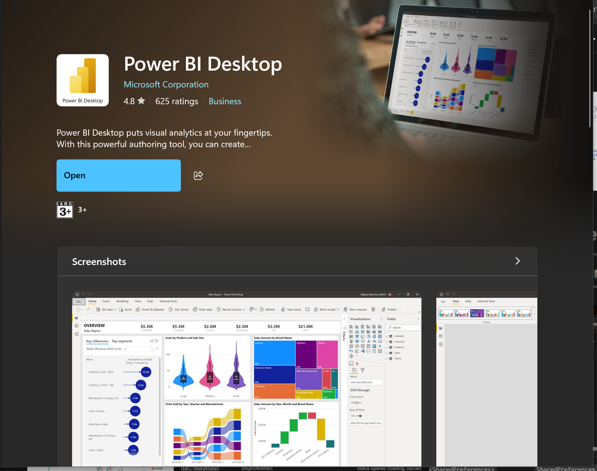

**b. Connector MySQL**
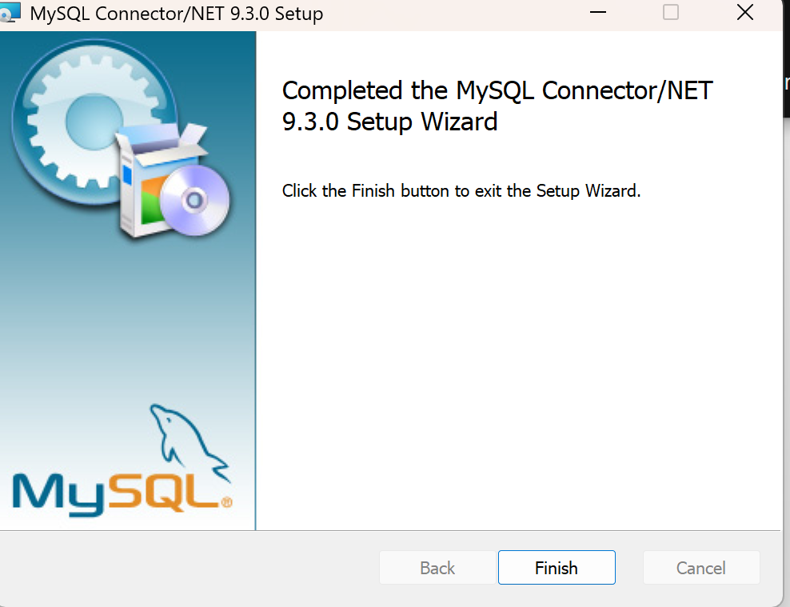

<br><br>

#### 2. Menyiapkan Container MySQL
**a. Pembuatan `docker-compose.yaml`**

```bash
version: '3.8'

services:
  db:
    image: mysql:8.0
    container_name: mysql-container
    restart: unless-stopped
    environment:
      MYSQL_ROOT_PASSWORD: rahasia123
      MYSQL_DATABASE: appdb
      MYSQL_USER: appuser
      MYSQL_PASSWORD: appsecret
    volumes:
      - mysql-data:/var/lib/mysql
    ports:
      - "3306:3306"

volumes:
  mysql-data:
```
<br>

**b. Running Container MySQL**
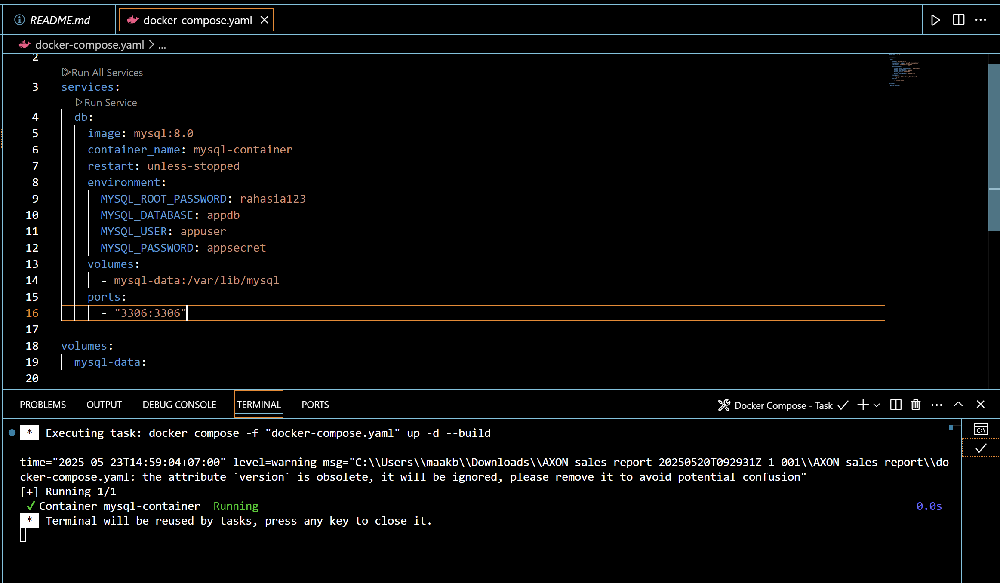
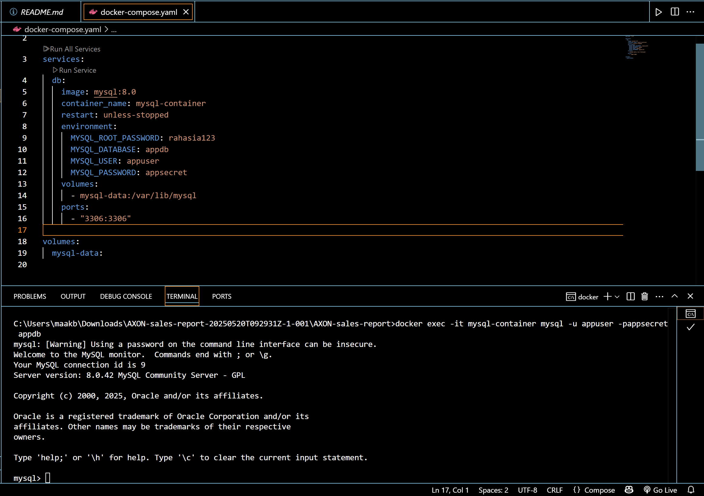

#### 3. Copy file sql database ke dalam container docker<br>
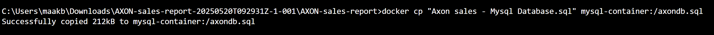

<br><br>

#### 4. running file sql database<br>
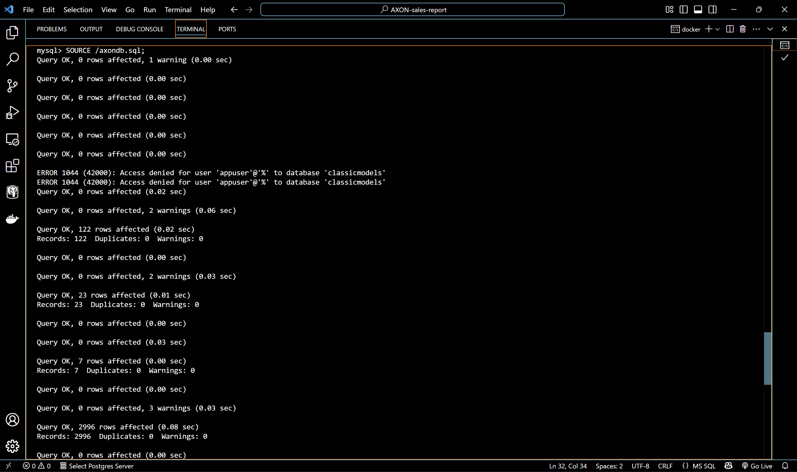<br><br>
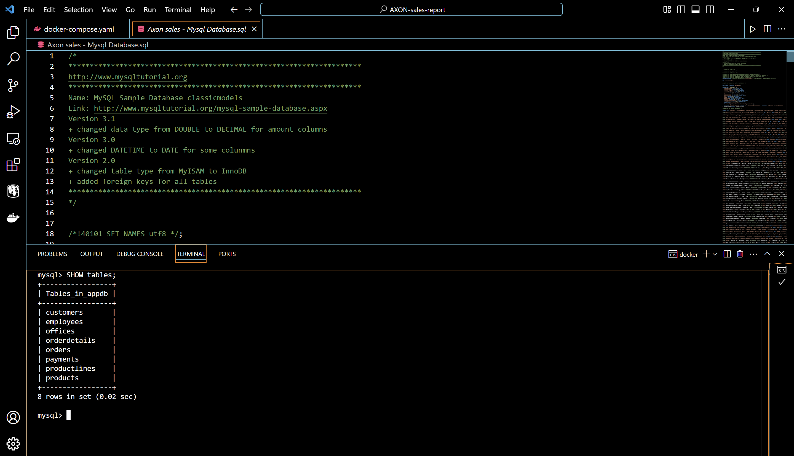

#### 5. menghubungkan ke Power BI<br>
**a. buka Power BI, tab Home, Get Data, pilih Database, pilih MySQL Database**
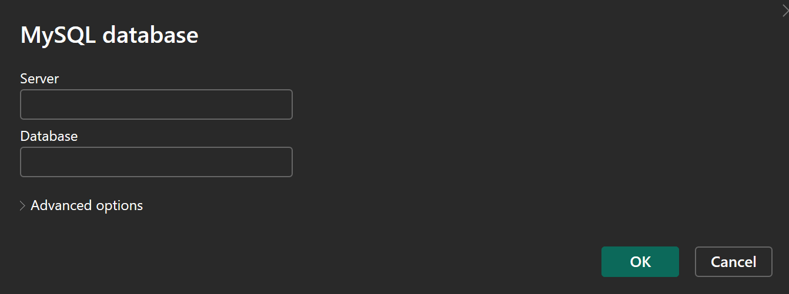

**b. masukkan username dan password dari database yang telah dibuat**
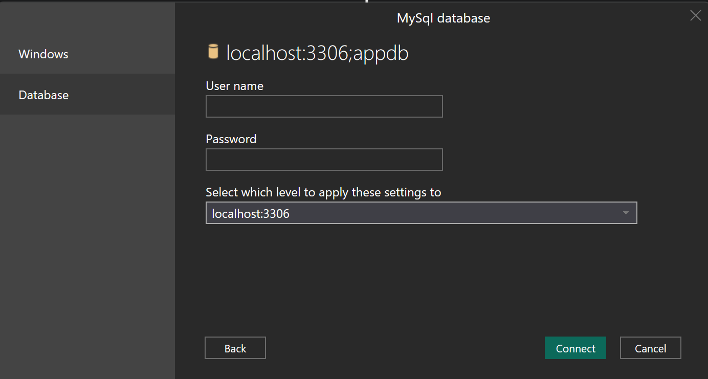

**c. pilih table yang akan diimpor**
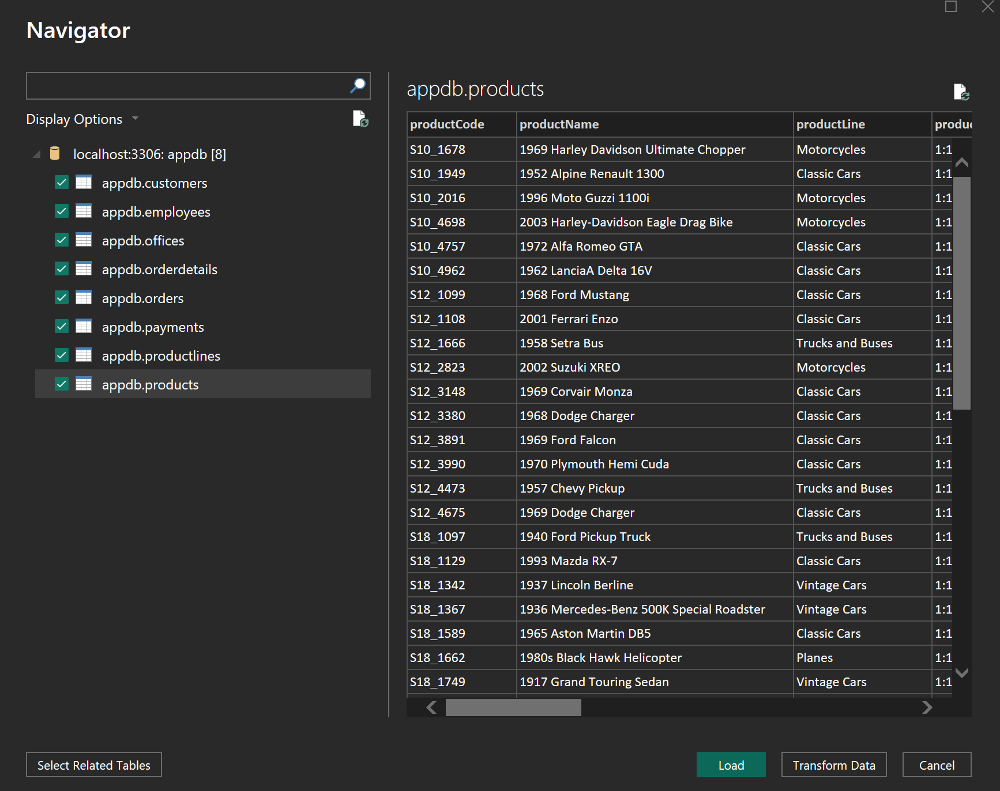

**d. visualkan data sesuai yang dibutuhkan**
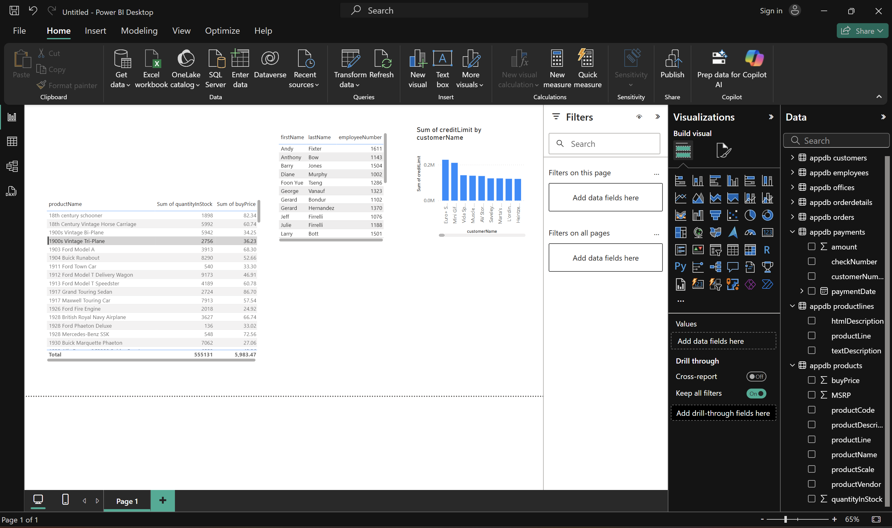