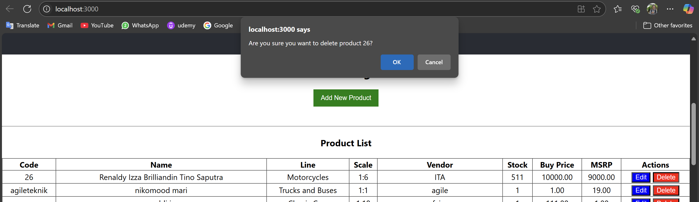

<div align="center">

### LAPORAN PRAKTIKUM
  

**Nama Dosen Pengampu**:  
Bapak Dr. Ferry Astika Saputra ST, M.Sc  
<br>
**Dikerjakan oleh**:  
Nama: Moch. Alif Akbar  
Kelas: 2 D4 IT A  
NRP: 3123600025  
<br>
**DEPARTEMEN TEKNIK INFORMATIKA DAN KOMPUTER**  
**POLITEKNIK ELEKTRONIKA NEGERI SURABAYA**  
**2025**  
</div>

---

### 1. Arsitektur Bisnis
#### Tujuan Bisnis Aplikasi:
- Meningkatkan efisiensi dalam pencatatan produk.
- Mempermudah pengelolaan data produk (stok, harga, deskripsi).
- Mengurangi kesalahan manual dalam pencatatan.

#### Proses Bisnis:
- Manajemen Produk: Penambahan produk baru, pembaruan informasi produk (harga, stok), penghapusan produk.

#### Pengguna Aplikasi:
- Admin Manajemen Produk: Memiliki akses untuk mencatat produk masuk ataupun keluar.

#### Nilai Bisnis yang Diharapkan
- Penghematan waktu dalam proses administrasi produk.
- Kemudahan dalam memanajemen produk.
<br><br>

### 2. Arsitektur Layanan
#### Layanan Aplikasi:
- Layanan Produk: Menyediakan fungsionalitas Create, Read, Update, Delete (CRUD) untuk data produk.

#### Arsitektur Data:<br><br>
<br><br>
- Entitas:
  - Products: Menyimpan informasi detail produk (kode, nama, line, skala, vendor, deskripsi, stok, harga, harga rekomendasi).
  - ProductLines: Menyimpan kategori dari produk.
- Relasi Antar Entitas:
  - One to One: 1 produk hanya dapat memiliki 1 anggota dari productlines.
  - Many to One: 1 productlines dapat dimiliki oleh beberapa anggota dari products.
- Sumber Data: Input manual dari User melalui web.
- Output Data: Informasi yang ditampilkan di web (daftar produk, form untuk pengisian, dan tombol untuk update & delete).
- Database: MySQL.
<br><br>

### 3. Arsitektur Aplikasi
#### Komponen Utama:
- Frontend:
  - Teknologi: React.js.
  - Tanggung Jawab: Membangun UI yang informatif, menangani input user, dan berkomunikasi dengan backend API untuk mengambil dan mengirim data ke db.
  - Struktur:
    - components/: folder untuk komponen UI.
    - services/: folder untuk modul yang akan menangani panggilan API ke backend.
    - App.js: Komponen utama yang mengatur layout dan route.
  - Alur Interaksi: user berinteraksi dengan form atau tabel => state pada React diperbarui => panggilan API ke backend.
- Backend:
  - Teknologi: Node.js dengan framework Express.js.
  - Tanggung Jawab: Menyediakan API RESTful yang dapat diakses oleh frontend, menangani logika bisnis, melakukan validasi data dari sisi server, serta berinteraksi dengan database MySQL.
  - Struktur:
    - server.js: konfigurasi server, middleware (CORS => ini agar web dapat komunikasi dengan origin yang berbeda, body-parser => mengubah json jadi objek yang siap digunakan).
    - config/: Konfigurasi app, seperti koneksi database (database.js).
    - models/: Definisi model entitas db. yang berguna agar data dapat dijadikan objek js.
    - routes/: Mendefinisikan endpoint-endpoint dari API.
    - controllers/: Berisi logika untuk setiap route.
  - Contoh Endpoint API:
    - GET /api/products: Mengambil semua produk.
    - GET /api/products/:productCode: Mengambil produk berdasarkan kodenya.
    - POST /api/products: Membuat produk baru.
    - PUT /api/products/:productCode: Memperbarui produk yang ada.
    - DELETE /api/products/:productCode: Menghapus produk.
  - Database:
    - Teknologi: MySQL versi 8.0.
    - Skema: Menggunakan tabel products dan productlines.
    - Akses: Backend Node.js/Express.js.
    <br><br><br><br>
  - Alur Kerja (Contoh: Menambah Produk Baru):
    1. User membuka halaman manajemen produk.
    2. User mengklik tombol "Tambah Produk", yang akan menampilkan komponen ProductForm.
    3. User mengisi detail produk pada ProductForm.
    4. Saat disubmit, ProductForm memanggil fungsi di productService.js.
    5. productService.js melakukan request HTTP POST ke backend API dengan membawa data produk.
    6. Backend Express.js menerima request di productRoutes.js, yang kemudian diteruskan ke productController.js.
    7. productController.js memvalidasi data dan menggunakan model Product dari Sequelize untuk menyimpan data ke tabel products di dalam database MySQL.
    8. Database MySQL menyimpan data.
    9. Sequelize dan controller menangani hasil create database dan mengirimkan respons JSON kembali ke frontend.
    10. Frontend React menerima respons hasil penambahan produk.
<br><br>

### 4. Arsitektur Infrastruktur<br><br>
<br><br>
- Lingkungan: Docker digunakan untuk membuat container. setiap container sendiri akan menjalankan satu layanan secara terisolasi, ini memastikan bahwa dependensi dan konfigurasi masing-masing layanan tidak saling mengganggu.
- Komponen Infrastruktur yang menggunakan docker container:
  - Layanan Database (db):
    - Image Docker: mysql:8.0.
    - Konfigurasi (docker-compose.yaml):
      - container_name: mysql-container.
      - restart: unless-stopped. => Container akan otomatis direstart jika berhenti, kecuali stopped.
      - environment: Mengatur MYSQL_ROOT_PASSWORD, MYSQL_DATABASE, MYSQL_USER, MYSQL_PASSWORD.
      - volumes: - mysql-data:/var/lib/mysql untuk menyimpan data MySQL ke container.
      - ports: - "3306:3306" untuk memetakan port MySQL dan port di kliennya.
      - healthcheck: memeriksa kesiapan database sebelum layanan lain bergantung padanya.
  - Layanan Backend (backend):
    - Pembangunan Image (docker-compose.yaml)
      build: ./proyek penjualan/backend_app. menginstruksikan Docker Compose untuk membangun image menggunakan Dockerfile di dalam backend_app.
    - Dockerfile Backend:
      ```bash
      FROM node:18-alpine
      WORKDIR /usr/src/app
      COPY package*.json ./
      RUN npm install
      COPY . .
      EXPOSE 3001 
      CMD [ "npm", "run", "dev" ]
      ```

      - FROM node:18-alpine: menyiapkan environment Node.js pada container.
      - WORKDIR /usr/src/app: Menentukan direktori kerja di dalam container.
      - copy package.json dari folder lokal ke dalam container
      - RUN npm install: menginstal semua dependensi berdasarkan package.json.
      - EXPOSE 3001: Memberitahu Docker bahwa container akan menggunakan port 3001.
      - CMD [ "npm", "run", "dev" ]: Menentukan perintah default saat container dijalankan, dalam hal ini menjalankan script dev dari package.json

    - Konfigurasi (docker-compose.yaml):
      - container_name: axon-backend.
      - restart: unless-stopped.
      - ports: - "3001:3001". untuk memetakan port backend dan port di kliennya.
      - environment: Menyediakan variabel environment untuk aplikasi Node.js.
      - volumes:
        - - ./proyek penjualan/backend_app:/usr/src/app: Mount kode backend dari host ke kontainer.
        - /usr/src/app/node_modules: Mencegah node_modules di kontainer tertimpa oleh folder host.
      - depends_on: { db: { condition: service_healthy } } memastikan backend dimulai setelah database siap.
      - command: npm run dev untuk menjalankan server development.

### 5. Screenshot Hasil:<br><br>

<br><br>
<br><br>

<br><br>
<br><br>

<br><br>
<br><br>

<br><br>
<br><br>

<br><br>
<br><br>

<br><br>
<br><br>

<br><br>
<br><br>

<br><br>