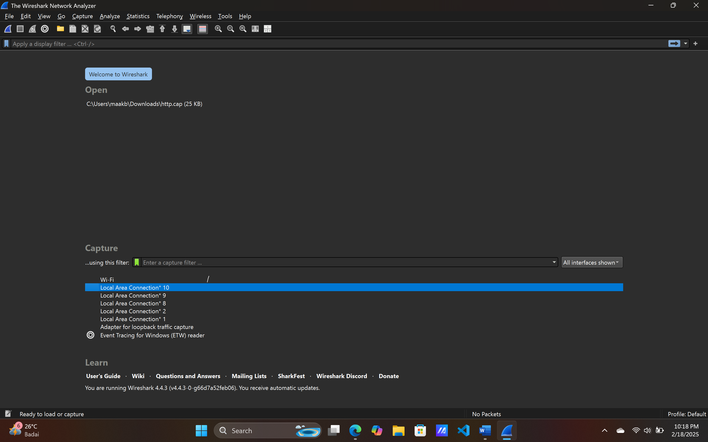
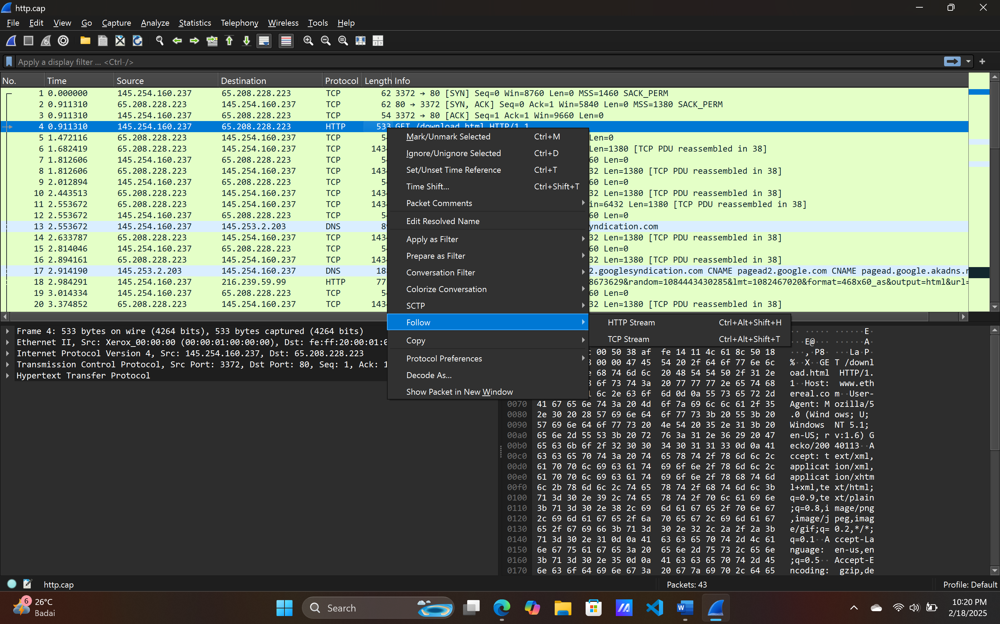
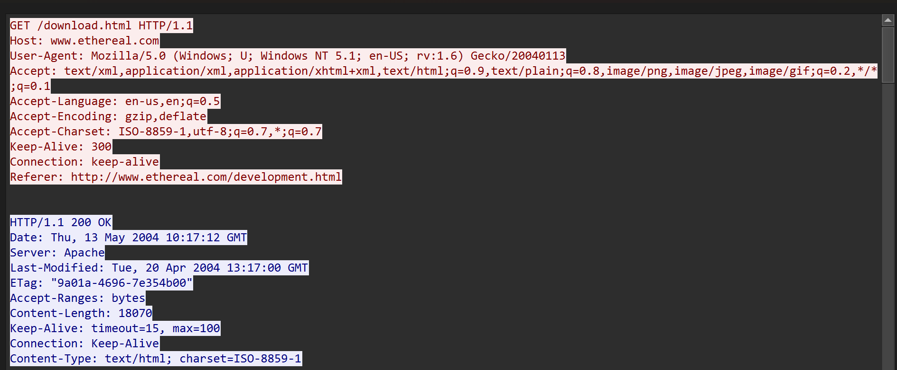
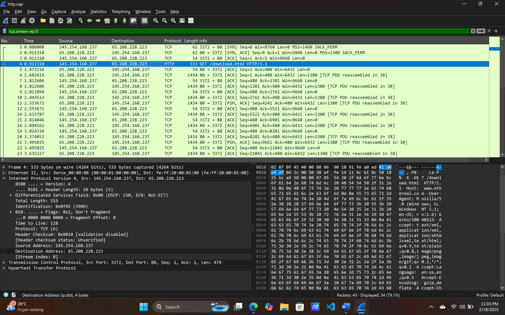
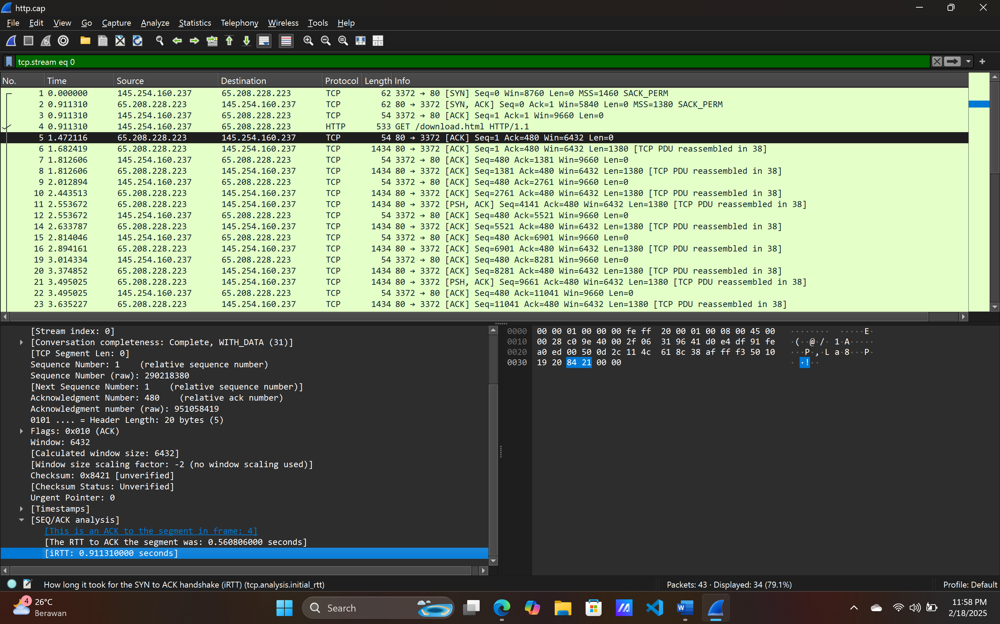
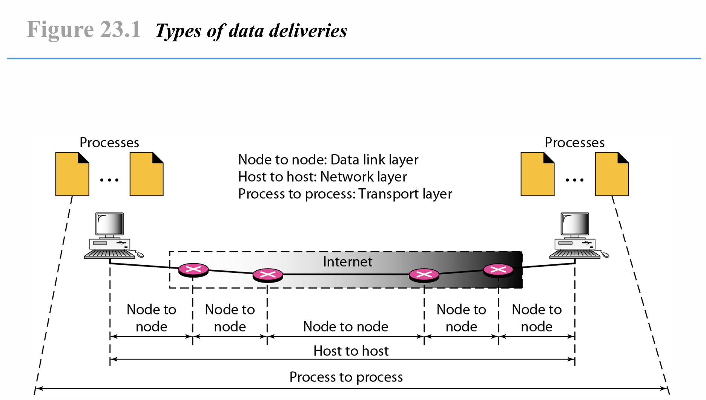
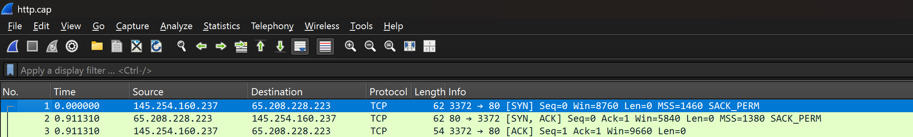
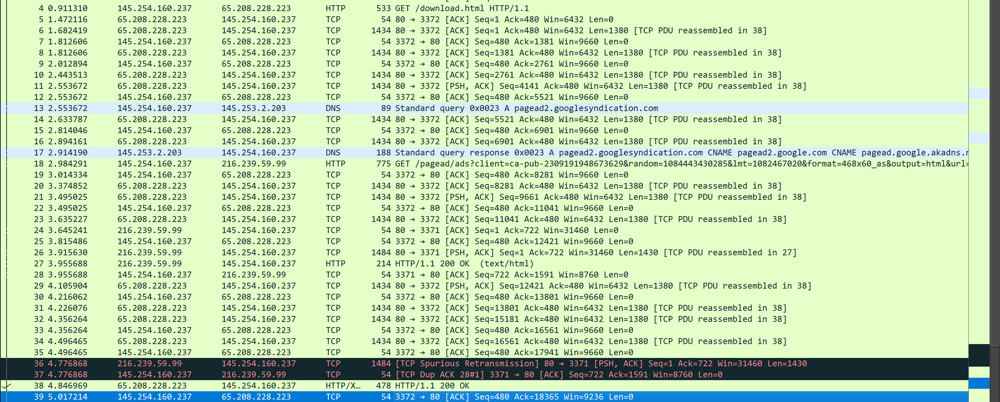
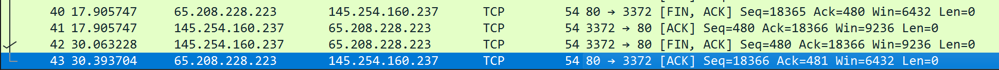

# LAPORAN PRAKTIKUM

*Tugas Workshop Administrasi Jaringan [REVIEW]*  

**Workshop Administrasi Jaringan**  

  

**Nama Dosen Pengampu**:  
Bapak Dr. Ferry Astika Saputra ST, M.Sc  
 
**Dikerjakan oleh**:  
Nama: Moch. Alif Akbar  
Kelas: 2 D4 IT A  
NRP: 3123600025  

**DEPARTEMEN TEKNIK INFORMATIKA DAN KOMPUTER**  
**POLITEKNIK ELEKTRONIKA NEGERI SURABAYA**  
**2024-2025**  

---

### **Soal**  
1. Analisa file `http.cap` dengan Wireshark:  
   - Versi HTTP yang digunakan  
   - IP address dari client maupun server  
   - Waktu client mengirimkan HTTP request  
   - Waktu server mengirimkan response dan durasinya  

2. Deskripsi gambar pada slide (Figure 23.1 Types of Data Deliveries)  

3. Rangkuman tahapan komunikasi menggunakan TCP  

---

### **Jawaban**  

#### **1. Analisis File `http.cap` dengan Wireshark**  

**a. Versi HTTP yang Digunakan**  
1. Buka Wireshark, pilih file `http.cap`.  
     
2. Pilih paket dengan protokol HTTP → Klik kanan → **Follow → TCP Stream**.  
     
3. Versi HTTP:  
     
   - **Client**: HTTP/**1.1**  
   - **Server**: HTTP/**1.1**  

    

**b. IP Address Client dan Server**  
1. Pilih salah satu paket HTTP.  
2. Buka **Internet Protocol** → Periksa **Source** dan **Destination Address**:  
     
   - **Client**: `145.254.160.237`  
   - **Server**: `65.208.228.223`  

 

**c. Waktu HTTP Request dan Response**  
1. **Waktu client mengirim request**: `0.911310` detik.  
     
2. **Waktu server mengirim response**: `1.472116` detik.  
     
3. **Durasi transfer**: `0.560806` detik (RTT dari **Seq/Ack Analysis**).  
     

---

#### **2. Deskripsi Gambar Figure 23.1: Types of Data Deliveries**  
  

Gambar di atas adalah ilustrasi dari hierarki pengiriman data berdasarkan lapisan model OSI, dan berfokus pada 3 lapisan, yakni: data link layer, network layer, dan transport layer.
1. **Data Link Layer (Node to Node)**:  
   pada data link layer, pengiriman data dilakukan antar node, node yang dimaksud adalah perangkat-perangkat jaringan seperti router, dan switch). Pengiriman dilakukan dengan data link layer akan mengemas paket dari network layer menjadi frame, dengan informasi tambahan seperti alamat MAC (Media Access Control) source dan destination. Lalu router akan mengirimkan data ke router lain dengan mengetauhi alamat MAC router tujuan tersebut. Bila alamat MAC tujuan tidak diketauhi, router akan menggunakan protokol seperti ARP(Address Resolution Protocol) untuk menemukan alamat MAC di jaringan. 

 

2. **Network Layer (Host to Host)**:  
   pada network layer, pengiriman data dilakukan antara host dengan host lainnya, yang berarti data akan dikirim dari satu perangkat ke perangkat lain(misal dari laptop ke server). Data yang akan dikirimkan akan dibungkus dalam packet, yang berisikan ip header(di antaranya berisikan alamat IP dari pengirim maupun penerima). Dengan adanya alamat IP ini maka router dapat memilih rute tercepat untuk sampai ke IP tujuan, baik melalui static routing maupun dynamic routing. 

 

3. **Transport Layer (Process to Process)**:  
   pengiriman data yang terjadi diatur oleh transport layer. Di mana transport layer akan memastikan data yang dikirim telah terurut. Di transport layer, setiap process akan diberikan port untuk membedakan 1 process dengan process lainnya. process di sini merujuk pada application/service yang berjalan di host, seperti web browser dan email server. Protokol yang digunakan untuk komunikasi ini bisa dengan TCP maupun UDP. Perbedannya adalah kalua TCP akan mengecek apakah segmen yang dia kirim telah sampai. Sedangkan UDP tidak mengecek datagram yang dikirimkan sampai ataupun tidak.

Ketiga lapisan tersebut membuat komunikasi antar device menjadi memungkinkan, process akan memberikan data yang nanti diproses di transport layer untuk menentukan besarnya kapasitas data yang dikirim(dibagi menjadi segmen segmen untuk memastikan data yang dikirim efisien dan dapat diurutkan ketika sampai ditujuan, lalu segmen tersebut memasuki network layer yang memberikan destinasi IP penerima dengan ditambahkannya IP header, dan pada data link paket tersebut akan ditambahkan MAC Address(alamat fisik) yang bertujuan untuk pengiriman(hop) selanjutnya hingga sampai ke IP tujuan.

 

**Alur Pengiriman Data**:  
- Data aplikasi → Transport Layer (dibagi menjadi segmen(tcp) / datagram(udp)) → Network Layer (paket -> IP header) → Data Link Layer (frame MAC).  

---

#### **3. Rangkuman Tahapan Komunikasi TCP**  

Komunikasi dalam TCP dibagi menjadi 3 tahap, yakni Connection Establishment, Data transfer, dan termination.

**a. Connection Establishment (3-Way Handshake)**  
  
1. **SYN**: 
Syn/synchronize adalah field dalam TCP header yang bertugas untuk memulai koneksi. Ini ditandai dengan sequence number untuk pengiriman data, dan flag syn yang di set.

 

2. **SYN-ACK**: 
Synchronize acknowledge, merupakan respon dari server bahwa telah menerima permintaan koneksi. Berisikan sequence number,  acknowledgment(ack) di mana didapatkan dari sequence number yang dikirimkan klien ditambah dengan 1. Seperti pada http.cap di atas sequence number client 0 menjadi ack 1.

 

3. **ACK**: 
Client mengirimkan paket ACK yang mengonfirmasi koneksi telah dibangun. Berisikan acknowledgment number yang didapat dari sequence number server + 1 dan sequence number yang dikirimkan meningkat 1 dari saat inisiasi awal.

  

**b. Data Transfer**  
Setelah koneksi berhasil dibuat, kedua device dapat saling melakukan bertukar data.
  

Seperti dalam data di atas client meminta data download.html dengan menggunakan metode get http.
Selanjutnya server merespon dengan memberikan acknowledge yang mengakui telah menerima permintaan client.

Lalu server memulai mengirimkan data, terlihat pada gambar di atas:
sequence number = urutan data
Acknowledge number = konfirmasi data yang dikirim oleh server telah diterima
Win = bagian dari kontrol dalam header TCP yang digunakan untuk mengontrol jumlah data yang dapat dikirimkan oleh server pada satu waktu tanpa menerima konfirmasi (ACK) dari klien. Ini memastikan bahwa server tidak perlu mengirim terlalu banyak data sekaligus, yang dapat menyebabkan buffer di sisi klien menjadi penuh.

dalam menerima data, client memiliki buffer yang menangani jumlah maksimum bytes. sehingga bila terjadi kelebihan pengiriman data, maka akan terjadi throttle, yang menyebabkan adanya retransmisi/latensi yang tinggi, dan hilangnya data. dan bila terjadi hal demikian, maka client akan mengirimkan balasan berupa ack yang dia terima dan meminta sequence yang hilang untuk dikirim ulang.

  

**c. Termination (4-Way Handshake)**  

  
**FIN, ACK:**
Server mengirimkan segmen FIN untuk memberitahukan bahwa data telah selesai terkirim dan ingin menutup koneksi.
ACK dalam paket ini menunjukkan yang diminta oleh client(dalam kasus ini get download.html).

**ACK:**
Client yang menerima paket FIN mengirimkan segmen ACK sebagai tanda bahwa client  telah menerima permintaan penutupan koneksi dari server.
Seq=480 di sini menunjukkan bahwa client telah mengakui telah menerima semua yang diminta, dan ack yang dikirimkan merupakan sequence nomor[fin, ack] server + 1,  yang artinya client telah menerima permintaan penutupan koneksi dari server.

**FIN, ACK:**
Client kemudian mengirimkan segmen FIN untuk menutup koneksi dari sisi client.
Segmen ini juga mengandung ACK untuk mengonfirmasi bahwa client sudah menerima permintaan penutupan koneksi dari pihak server.

**ACK:**
Server mengirimkan ACK sebagai respons untuk mengonfirmasi bahwa server sudah menerima segmen FIN dari client.
Setelah paket ini diterima, koneksi TCP dianggap sepenuhnya ditutup, dan kedua pihak bisa melepaskan sumber daya yang digunakan untuk komunikasi.
