<div align="center">

# LAPORAN PRAKTIKUM


*Process Control && The File System*  

**Workshop Administrasi Jaringan**  

  

**Nama Dosen Pengampu**:  
Bapak Dr. Ferry Astika Saputra ST, M.Sc  
<br>
**Dikerjakan oleh**:  
Nama: Moch. Alif Akbar  
Kelas: 2 D4 IT A  
NRP: 3123600025  

**DEPARTEMEN TEKNIK INFORMATIKA DAN KOMPUTER**  
**POLITEKNIK ELEKTRONIKA NEGERI SURABAYA**  
**2024-2025**  
</div>

---

## Process Control

#### komponen dari Process
Proses terdiri atas 2 bagian utama yakni address space dan data structures dalam kernel.
- ***Address space:*** adalah serangkaian *memory page* yang telah ditandai oleh kernel untuk digunakan oleh proses. (*memory pages* ini adalah unit-unit yang digunakan dalam memanajemen memori, biasanya berkisar antara 4/8KiB). kawasan ini menyimpan kode, data, dan stack dari proses.
- ***data structures within the kernel:*** menyimpan informasi tentang status proses, prioritas, dan parameter penjadwalan, dll.

proses dapat dipandang sebagai wadah yang berisi sekumpulan sumber daya yang dikelola oleh kernel untuk program yang berjalan, ini termasuk pada:
- ***memory pages*** (untuk menyimpan kode dan data program).
- ***file descriptors***(untuk mengacu pada file yang dibuka).
- ***information status*** (seperti status proses, dan sumber daya yang digunakan).

**Data yang dicatat oleh kernel**
- *The process's address space map* (peta ruang alamt dari proses).
- *The current status of the process (running, sleeping, and so on).*
- *The process's priority*
- *Information about the resources the process has used (CPU, memory, and so on)*
- *Information about the files and network ports the process has opened*
- *The process's signal mask (the set of signals that are currently blocked)*
- *The owner of the process (the user ID of the user who started the process)*

**Thread dalam proses**

- ***Thread*** adalah konteks eksekusi dalam sebuah proses.
- sebuah proses dapat memiliki banyak ***thread***, yang berbagi ruang alamat dan sumber daya lainnya.
- ***Thread*** dikenal juga dengan ***lightweight processes*** karena lebih mudah untuk dibuat dan dihancurkan dibandingkan proses, dan digunakan untuk mencapai ***parallelism*** dalam eksekusi program.

Contoh penggunaan Thread(pada web server):
- web server ***listens***(mendengarkan) koneksi yang masuk dan kemudian membuat thread baru untuk menangani setiap ***request***(permintaan).
- setiap thread menangani 1 permintaan, tetapi karena ada banyak thread, web server dapat menangani banyak request secara bersamaan.

pada contoh ini, web server adalah proses, dan setiap thread terbagi dalam konteks eksekusi di dalam proses.

##### PID: process ID number

***PID*** adalah **nomor unik** integer yang diberikan oleh kernel ketika dibuat. berfungsi untuk mengidentifikasi setiap proses. PID digunakan dalam berbagai pemanggilan sistem untuk merujuk pada proses tertentu(seperti mengirim sinyal ke proses).

**Namespace dan PID dalam container**
***namespaces*** memungkinkan proses memiliki PID yang **sama** dalam konteks yang berbeda. konsep ini digunakan dalam membuat ***containers*** yaitu ***isolated environtments***/lingkungan terisolasi yang memiliki pandangan atau "view" sendiri terhadap sistem. container memungkinkan eksekusi berbagai instance aplikasi pada sistem yang sama, di mana setiap aplikasi dijalankan dalam container yang terpisah dan terisolasi satu sama lain.

##### PPID (parent Process ID)

- setiap proses terasosiasi dengan parent process, yaitu process yang membuatnya.
- PPID => PID dari process's parent.
- digunakan untuk merujuk pada parent process di dalam berbagai pemanggilan sistem, seperti pengiriman sinyal ke parent process.

##### The UID and EUID: user ID and effective user ID

- ***UID*** adalah ID user yang menjalankan proses.
- ***EUID*** adalah ID user yang digunakan oleh proses untuk menentukan akses ke sumber daya. ini digunakan untuk mengontrol akses ke file, port, dan resource lainnya.

#### Lifecycle of a Process

- ***Forking Proses:*** proses dimulai ketika dia membuat salinan dari dirinya sendiri menggunakan system fork call. fork membuat salinan hampir identik dari proses induk(parent process) yang akan memiliki ID Proses(PID) dan informasi akuntansi(accounting information) yang berbeda. (pada linux, prosesini menggunakan clone, yang merupakan superset dari fork yang menghandle threads dan termasuk dengan fitur tambahan lainnya. fork tetap ada di kernel untuk "Fork tetap ada di kernel untuk backward compatibility(kompatibilitas mundur), tetapi memanggil clone secara internal.)
- ***Proses Init/systemd:*** ketika sistem booting, kernel secara otomatis membuat dan menginstall beberapa proses. yang paling terkenal adalah *init* atau *systemd*, yang merupakan proses pertama(PID 1). Proses ini menjalankan skrip *system's startup* yang mengatur bagaimana sistem operasi akan berjallan. walaupun cara pastinya sedikit berbeda antara UNIX dan Linux, semua proses selain yang dibuat oleh kernel adalah turunan dari proses ini.

##### Signals

sinyal adalah cara untuk memberitahukan proses tentang kejadian tertentu.

sekitar 30 perbedaan dapat digunakan dalam berbagai konteks:
- sinyal digunakan untuk komunikasi antar proses.
- sinyal dapat dikirim oleh terminal untuk kill, interupt, ataupun suspend ketika tombol tertentu ditekan.
- sinyal dapat dikirim oleh administrator untuk menghentikan atau mengubah perilaku proses.
- sinyal dapat dikirim oleh kernel ketika proses melakukan kesalahan seperti division by zero, selain itu juga disebabkan untuk memberi tahu proses tentang kondisi tertentu, seperti kematian child process ataupun I/O yang tersedia.

  

**Macam-macam Sinyal**
- **KILL:** sinyal ini tidak bisa diblokir ataupun ditangani oleh proses dan secara langsung menghentikan proses pada level kernel.
- **INT:** dikirim ketika pengguna menekan Ctrl+C di terminal. proses bisa menangani sinyal ini untuk menghentikan operasi dan kembali ke input terminal.
- **TERM:** sinyal ini meminta proses untuk menghentikan eksekusinya dengan cara yang lebih "halus". di mana proses diharapkan melakukan pembersihan sebelum keluar.
- **HUP:** dikirim saat terminal yang mengontrol proses ditutup. biasanya digunakan untuk memberitahu proses daemon untuk start, seperti memuat konfigurasi baru.
- **QUIT:** mirip dengan TERM, tetapi jika tidak ditangani, biasanya menghasilkan core dump, yaitu salinan memori proses untuk debugging. Beberapa program mengkonsumsi sinyal ini dan menafsirkannya untuk berarti hal lain.

##### Kill: send signals

seperti namanya, command **kill** paling sering digunakan untuk mengakhiri proses. kill dapat mengirim sinyal apapun, tetapi defaultnya mengirim TERM. kill dapat digunakan oleh normal user untuk proses mereka sendiri atau dari root dari suatu proses. sintaknya:

> kill [-signal] pid

where signal is the number or symbolic name of the signal to be sent and pid is the process identication number of the target process.

contoh: kill -9 pid mengirimkan sinyal KILL yang akan langsung menghentikan proses, tanpa bisa diblokir atau ditangani.

**killall:**  membunuh proses berdasarkan nama, bukan PID. ini tidak tersedia pada semua systems.

> Contoh: killall firefox 

menghentikan semua proses yang bernama "firefox".

**pkill:** sama seperti ***killall*** tetapi dengan opsi yang lebih banyak untuk memilih proses berdasarkan kriteria tertentu, seperti nama pengguna atau ID grup. contoh:

> pkill -u abdoufermat # kill all processes owned by user abdoufermat

---

#### PS: Monitoring processes

**Perintah *ps* untuk Memantau proses:**

**ps** adalah alat utama yang digunakan oleh administrator sistem untuk memonitor proses yang sedang berjalan di sistem Linux/Unix. walaupun versi dari ps berbeda pada argumen dan tampilan, tetapi informasi yang diberikan esensinya sama.

Perintah ini memberikan informasi tentang berbagai atribut penting dari proses yang sedang berjalan, seperti:
- **PID (Process ID):** ID unik untuk setiap proses.
- **UID (User ID):** ID pengguna yang menjalankan proses.
- **Prioritas (Priority):** Mengindikasikan prioritas proses.
- **Terminal Kontrol (Control Terminal):** Terminal yang digunakan untuk menjalankan proses tersebut.
- **Penggunaan Memori dan CPU:** Berapa banyak memori dan waktu CPU yang digunakan oleh proses.
- **Status Proses:** Seperti running (berjalan), sleeping (tidur), stopped (dihentikan), dll.

**argumen pada *ps***

- **ps aux** adalah perintah yang memberikan gambaran umum yang sangat berguna tentang semua proses yang berjalan di sistem:
  - a: Menampilkan proses dari semua pengguna.
  - u: Menampilkan informasi lebih detail tentang proses.
  - x: Menampilkan proses yang tidak terkait dengan terminal tertentu.
  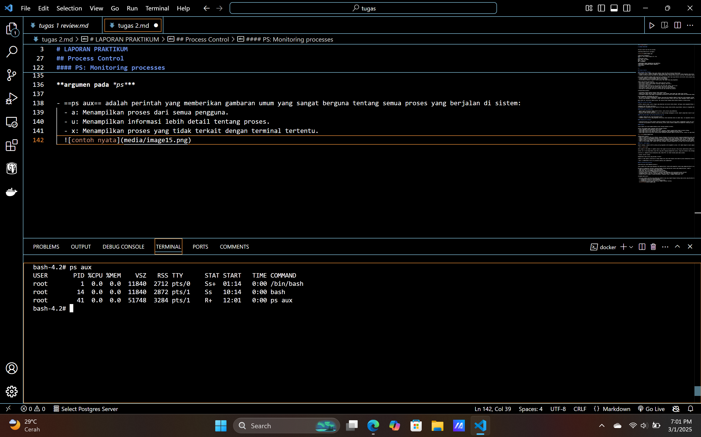  

  <br>
  penjelasan:

    

- **ps lax** adalah variasi lain yang memberikan informasi lebih teknis mengenai proses, tetapi sedikit lebih cepat dibandingkan dengan ps aux karena tidak perlu menyelesaikan nama pengguna atau grup.
  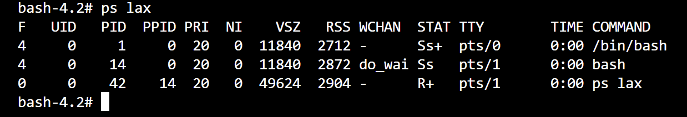 

- ***grep*** dapat digunakan untuk memfilter output dari perintah ps agar mencari proses tertentu. Contoh untuk mencari proses yang terkait dengan Bash:
  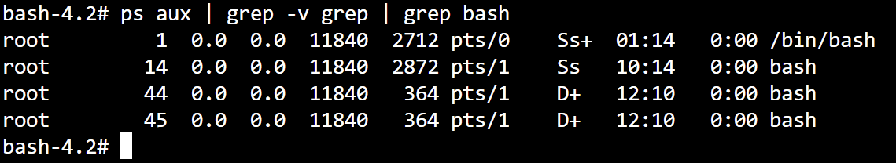

- ***pgrep*** adalah cara lain untuk mencari PID dari sebuah proses berdasarkan nama:
  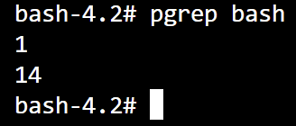

- ***pidof*** juga dapat digunakan untuk menemukan PID berdasarkan jalur eksekusi aplikasi:
  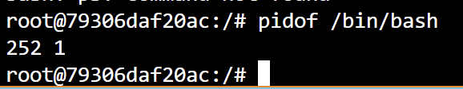

---

#### Pemantauan Interaktif dengan top

Perintah ***top*** memberikan tampilan dinamis secara real-time dari sistem yang sedang berjalan. Perintah ini dapat menampilkan informasi ringkasan sistem serta daftar proses atau thread yang saat ini dikelola oleh kernel Linux. Jenis informasi ringkasan sistem yang ditampilkan, serta jenis, urutan, dan ukuran informasi yang ditampilkan untuk proses dapat dikonfigurasi oleh pengguna dan konfigurasi tersebut dapat dipertahankan bahkan setelah restart.

Secara default, tampilan diperbarui setiap 1-2 detik, tergantung pada sistem.

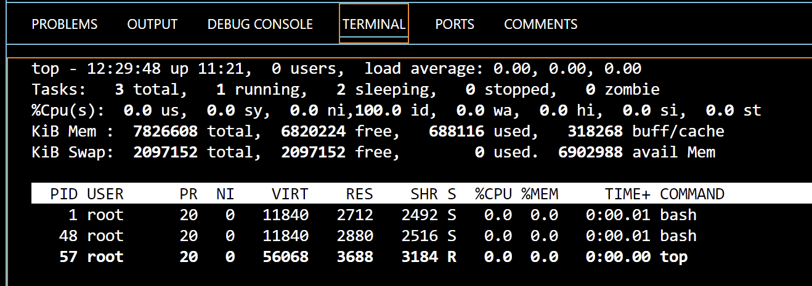

Terdapat juga perintah ***htop***, yang merupakan penampil proses interaktif untuk sistem Unix. Ini adalah aplikasi berbasis teks (untuk terminal console atau X) dan memerlukan *ncurses*. htop mirip dengan top, tetapi memungkinkan untuk scroll secara vertikal dan horizontal, sehingga dapat melihat semua proses yang sedang berjalan di sistem, beserta baris perintah lengkapnya. htop juga memiliki tampilan yang lebih baik dan lebih banyak opsi untuk operasi.

---

#### Nice dan renice: mengubah prioritas dari process

##### pengertian
niceness adalah sebuah nilai numerik yang digunakan oleh kernel untuk memberikan **prioritas** kepada sebuah proses yang berjalan. nilai ini mengindikasikan bagaimana kernel harus memperlakukan proses tersebut dalam pembagian waktu CPU dengan proses lain.
- **Niceness tinggi (nilai besar, misalnya +10 hingga +19):** artinya proses tersebut memiliki **prioritas rendah**. Dengan kata lain, proses ini akan mendapatkan lebih sedikit waktu CPU dibandingkan proses dengan prioritas tinggi. Proses ini "lebih baik" dalam hal memberi kesempatan bagi proses lain untuk mendapatkan CPU.
- **Niceness rendah atau negatif (misalnya -20 hingga 0):** artinya proses tersebut memiliki **prioritas tinggi**. Proses ini akan mendapat lebih banyak waktu CPU dibandingkan dengan proses lainnya, karena dianggap lebih penting.

**Rentang Nilai Niceness:**
- di **Linux**, nilai niceness berkisar antara **-20 (prioritas tertinggi)** hingga **+19 (prioritas terendah)**.
- di **FreeBSD**, nilai niceness dapat berkisar **antara -20 hingga +20**.

**Contoh Penggunaan Niceness:**
- Jika ingin menjalankan sebuah task yang memerlukan banyak CPU (misalnya komputasi berat), dan ingin proses tersebut berjalan di background tanpa mempengaruhi kinerja proses lain, kita bisa memberi niceness tinggi.
- Sebaliknya, jika ingin menjalankan sebuah proses yang sangat penting (misalnya server web atau aplikasi penting), kita bisa memberi niceness rendah untuk memastikan proses tersebut mendapat prioritas tinggi dalam penggunaan CPU.

##### perintah **nice**:
digunakan untuk memulai sebuah proses dengan nilai niceness tertentu, yang mengatur prioritas proses saat dimulai.

> sintaks: nice -n nice_val [command]

- nice_val adalah nilai niceness yang ingin diberikan kepada proses. Nilai ini bisa berupa angka antara -20 hingga +19 di Linux.
- command adalah perintah yang dijalankan untuk memulai proses tersebut.

contoh:
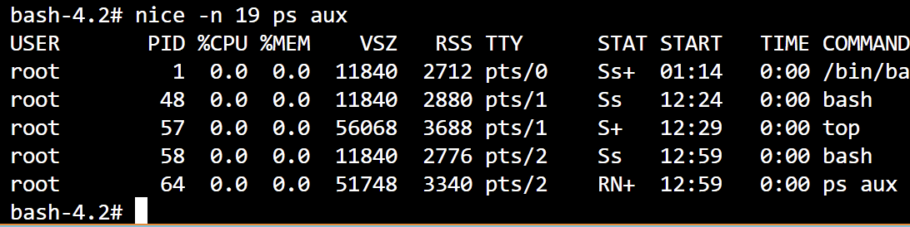
*perintah ini akan menjalankan ps aux dengan priority paling rendah.*

##### perintah **renice**:
digunakan untuk mengubah nilai niceness dari proses yang sedang berjalan.

sintaks:
```bash
renice -n nice_val -p pid
```
- nice_val adalah nilai niceness baru yang ingin diberikan ke proses.
- pid adalah ID Proses (Process ID) dari proses yang ingin diubah niceness-nya.

contoh: 
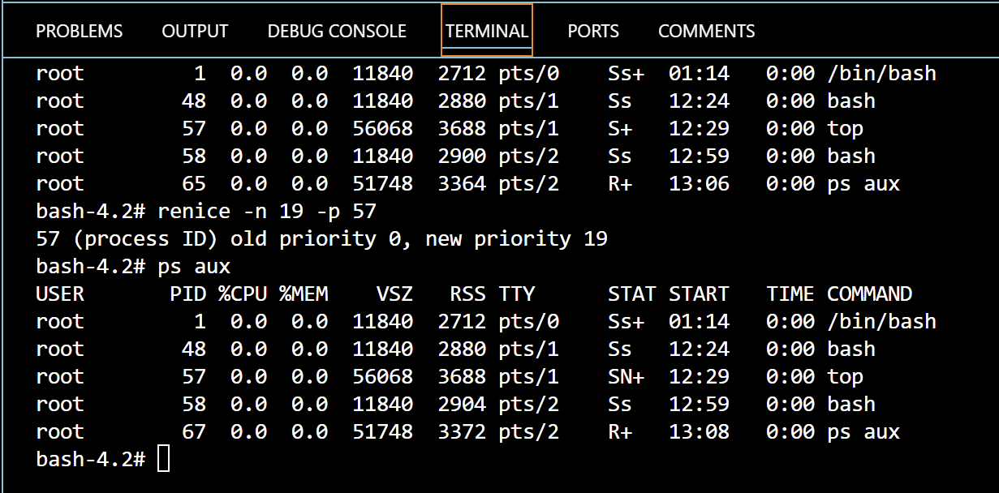
*perintah ini akan mengubah top menjadi priority yang paling rendah.*

##### priority value
priority value/Nilai prioritas adalah prioritas aktual dari proses yang digunakan oleh kernel Linux untuk menjadwalkan sebuah tugas. Di sistem Linux, nilai prioritas berkisar antara 0 hingga 139, di mana 0 hingga 99 untuk real-time dan 100 hingga 139 untuk pengguna.

Hubungan antara value nice dan prioritas adalah sebagai berikut:

> priority_value = 20 + nice_value

Nilai nice default adalah 0. Semakin rendah nilai nice, semakin tinggi prioritas dari proses tersebut.

---

#### The /proc filesystem
Versi Linux dari ps dan top membaca informasi status proses mereka dari direktori /proc, sebuah sistem file pseudo di mana kernel mengekspos berbagai informasi menarik tentang status sistem.

Meskipun namanya /proc, ini berisi informasi lain selain hanya proses (statistik yang dihasilkan oleh sistem, dll).

Proses-proses direpresentasikan oleh direktori di /proc, dan setiap proses memiliki direktori yang dinamai sesuai dengan PID-nya. Direktori /proc berisi berbagai file yang menyediakan informasi tentang proses, seperti command line, variabel lingkungan, deskriptor file, dan sebagainya.


---

#### Strace and truss
untuk mengetauhi apa yang proses lakukan, kita dapat menggunakan ***strace*** untuk linux, ataupun ***truss*** untuk freebsd. command tersebut melacak system calls dan signals. ini dapat digunakan untuk debug suatu program ataupun memahami apa yang program tersebut lakukan.

contoh:
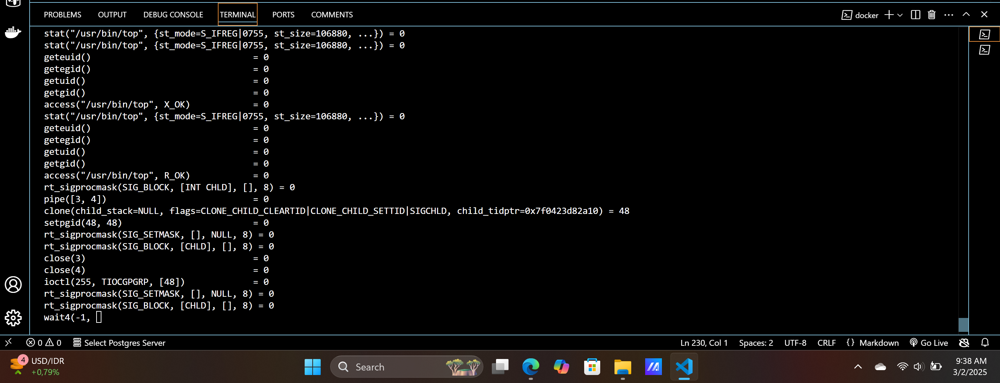

---

#### Runaway processes
kadang-kadang terjadi sebuah proses yang tidak merespons dengan baik terhadap sistem dan mengonsumsi sumber daya secara berlebihan. Biasanya, proses ini akan mengabaikan prioritas penjadwalan yang telah ditentukan dan menggunakan 100% CPU, yang mengakibatkan proses lain kesulitan mendapatkan akses ke CPU. Akibatnya, sistem menjadi sangat lambat. Proses seperti ini disebut sebagai ***runaway process***.

Untuk menghentikan proses seperti ini, kita bisa menggunakan command kill. Jika proses tidak merespons sinyal TERM, kita bisa menggunakan sinyal KILL untuk memaksa proses berhenti.

Contoh perintah untuk menghentikan proses yang tidak merespons:
```bash
kill -9 pid

atau

kill -KILL pid
```

Kita juga bisa menggunakan alat seperti ***strace*** atau truss untuk menganalisis penyebab proses yang berjalan liar tersebut. Misalnya, jika proses yang bermasalah menghasilkan banyak output, hal ini bisa mengisi sistem file hingga penuh.

Untuk memeriksa penggunaan sistem file, kita bisa menggunakan perintah ***df -h***. Jika sistem file penuh, kita bisa menggunakan perintah ***du*** untuk mencari file atau direktori yang paling besar.

Selain itu, kita bisa menggunakan perintah **lsof** untuk melihat file apa saja yang sedang dibuka oleh proses tersebut:
```bash
lsof -p pid
```

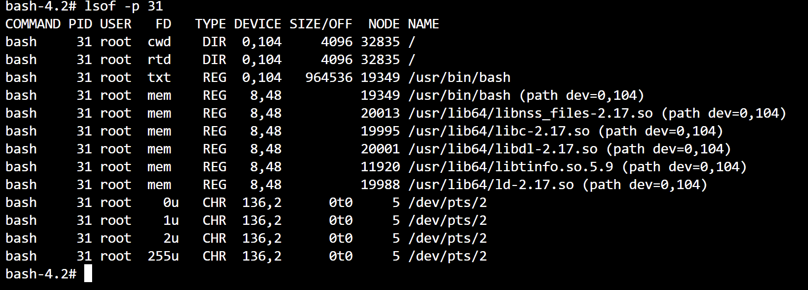

---

#### Periodic processes

##### schedule command
***Cron*** adalah alat tradisional yang digunakan untuk menjalankan perintah secara otomatis pada waktu yang telah ditentukan. Cron berjalan saat sistem booting dan terus berjalan selama sistem hidup. Cron membaca file konfigurasi yang berisi daftar perintah dan waktu kapan perintah tersebut dijalankan. command line dieksekusi dengan **sh**, jadi hampir semua yang bisa dilakukan di shell bisa dilakukan cron.
File konfigurasi cron disebut ***crontab*** (singkatan dari "cron table"). Setiap pengguna memiliki crontab yang disimpan di direktori tertentu, misalnya /var/spool/cron di Linux.

##### format crontab
Crontab memiliki lima kolom untuk menentukan waktu eksekusi perintah, yaitu menit, jam, hari dalam bulan, bulan, dan hari dalam minggu. Setelah itu, perintah yang ingin dijalankan ditulis.
```bash
*     *     *     *     *  command untuk dieksekusi
-     -     -     -     -
|     |     |     |     |
|     |     |     |     +----- day of week (0 - 6) (Sunday=0)
|     |     |     +------- month (1 - 12)
|     |     +--------- day of month (1 - 31)
|     +----------- hour (0 - 23)
+------------- min (0 - 59)
```

**crontab management**
Perintah crontab digunakan untuk membuat, mengubah, dan menghapus crontab. Beberapa opsi penting:
- *crontab -e* untuk mengedit crontab.
- *crontab -l* untuk melihat crontab.
- *crontab -r* untuk menghapus crontab.

##### Systemd timer
Selain cron, ***systemd timers*** juga dapat digunakan untuk menjadwalkan tugas. Timer systemd lebih fleksibel dan kuat dibandingkan cron. Timer ini diaktifkan oleh **unit service** terkait yang dijalankan sesuai waktu yang ditentukan dalam file timer.

Perintah ***systemctl*** digunakan untuk mengelola unit systemd, termasuk timer. Contoh untuk melihat timer yang aktif:
```bash
systemctl list-timers
```
Contoh unit timer **logrotate.timer** yang dijadwalkan untuk menjalankan logrotate.service setiap tengah malam.
1. **Mengirim email otomatis:** cron atau systemd timer dapat digunakan untuk mengirimkan email laporan secara otomatis setiap bulan.
2. **Membersihkan sistem file:** menjalankan skrip setiap hari untuk menghapus file yang sudah lebih dari 30 hari di direktori sampah.
3. **Rotasi log file:** menjalankan rotasi log file yang membagi file log menjadi beberapa bagian, berdasarkan ukuran atau tanggal.
4. **Menjalankan batch job:** menjalankan perhitungan panjang (misalnya ETL) secara otomatis.
5. **Cadangan dan pencerminan:** melakukan backup otomatis atau mencerminkan sistem file menggunakan rsync.

---

## The filesystem

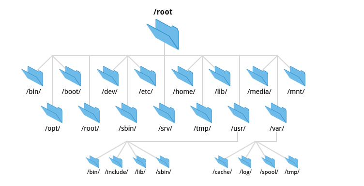

filesystem berfungsi untuk mengatur dan mengelola data yang disimpan pada media penyimpanan.
##### komponen utama:
1. namespace: cara sistem memberi nama dan mengatur file serta direktori.
2. API: panggilan sistem yang memungkinkan perangkat lunak berinteraksi dengan sistem berkas.
3. security model: mengimplementasikan fitur keamanan untuk melindungi file dan data. Ini bisa mencakup kontrol akses pengguna (siapa yang bisa membaca, menulis, atau mengeksekusi file), enkripsi, dan mekanisme untuk mencegah akses atau manipulasi yang tidak sah.
4. implementation: software untuk menghubungkan logical model dengan hardware.

filesystem yang berbasis disk didominasi oleh ext4, XFS, dan UFS filesystem, bersama dengan ZFS dan Btrfs.

kebanyakan filesystem modern mencoba untuk mengimplementasikan fungsionalitas tradisional filesistem dengan kecepatan dan kehandalan yang lebih baik, atau mereka menambahkan fitur seperti layer di atas semantics filesystem standar.

---

#### Pathnames

kata folder hanya bahasa yang digunakan oleh windows dan macOS. ini sama seperti **directori**, yang mana lebih teknis.

daftar directori yang mengarah ke sebuah file dinamakan **pathname**. pathname adalah sebuah string yang mendeskribsikan lokasi file di hirarki filesystem. pathname dapat menjadi absolute, seperti /home/username/file.txt, ataupun relatif seperti ./file.txt.

---

#### Filesystem Mounting and Unmounting

filesystem terdiri dari bagian yang lebih kecil, juga dinamakan "filesystems" yang masing masing terdiri dari 1 direktori beserta subdirektori dan filenya. kita menggunakan istilah **file tree** untuk merujuk pada keseluruhan layout dan menyimpan kata **filesystem** untuk cabang-cabang yang terhubung ke pohon tersebut.

dalam kebanyakan situasi, filesystems dipasang ke tree(pohon) dengan command **mount point**, untuk root ke filesystem yang baru.
contoh:
```bash
# Mount the filesystem on /dev/sda4 to /users
mount /dev/sda4 /users
```

linux mempunyai opsi lazy unmount **(umount -l)**  yang menghapus filesystem dari penamaan hierarki tetapi tidak benar-benar melepaskannya sampai tidak lagi digunakan.

**umount -f** adalah unmount paksa, yang berguna ketika filesystem sibuk.

daripada langsung menggunakan **umount -f**, kita dapat menggunakan ***lsof*** atau ***fuser*** untuk mencari tahu proses yang menggunakan filesystem dan menghentikan proses-proses tersebut.

contoh:
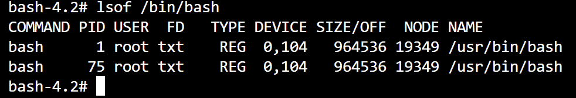

untuk melihat proses yang menjalankan filesystem, kita dapat menggunakan command ps:
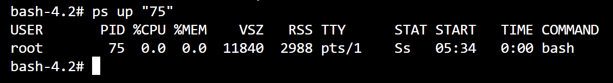

---

#### Organization of the file tree

##### root filesystem
**Root directory** (/) adalah direktori utama dari sistem UNIX yang berisi berkas-berkas dan subdirektori.

subdirektori yang ada dalam root directory mencakup:
- **/boot:** Biasanya berisi file kernel dari sistem operasi. File kernel ini bisa bervariasi dalam hal nama dan lokasi tergantung pada distribusi UNIX yang digunakan.
- **/etc:** Menyimpan file konfigurasi sistem yang penting. Misalnya, file konfigurasi jaringan, file user dan grup, konfigurasi login, dan lainnya.
- **/sbin dan /bin:** Direktori untuk utilitas penting yang diperlukan untuk operasi dasar sistem. Perbedaan utama antara keduanya adalah:
  - **/bin** berisi program yang digunakan oleh pengguna biasa dan sistem saat berjalan dalam mode pemulihan.
  - **/sbin** berisi program yang digunakan oleh administrator sistem atau untuk pemeliharaan sistem.
- **/tmp:** Menyimpan file sementara yang digunakan oleh aplikasi dan sistem. Direktori ini dapat dibersihkan secara berkala.
- **/dev:** Biasanya berisi file perangkat (device files), yang menggambarkan perangkat keras dan perangkat lunak. Namun, di sistem modern, /dev merupakan sistem file virtual yang dimuat terpisah.
- **/lib atau /lib64:** Berisi library berbagi (shared libraries) yang diperlukan oleh program yang berada di dalam /bin dan /sbin. Library ini berfungsi untuk menjalankan aplikasi.
- **/usr:** Menyimpan program yang tidak bersifat kritis terhadap sistem namun penting untuk pengguna. Di dalamnya terdapat file program standar, manual online, dan sebagian besar library. Subdirektori di dalam /usr meliputi:
  - **/usr/lib:** Berisi library yang digunakan oleh aplikasi di /usr.
  - **/usr/local:** Digunakan oleh sistem operasi seperti FreeBSD untuk menyimpan konfigurasi lokal dan aplikasi yang diinstal oleh pengguna.
- **/var:** Menyimpan data yang terus berubah atau tumbuh secara dinamis, seperti log file, data spool printer, database sementara, dan informasi yang berbeda pada setiap sistem. Ini termasuk file log untuk sistem, aplikasi, serta data spool yang berubah secara cepat.


contoh:
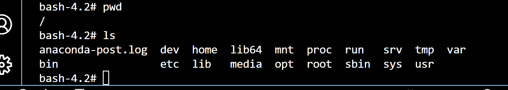

---

#### File types
kebanyakan implementasi filesystem didefinisikan menjadi 7 tipe file, yakni:

**1. Regular files**
   File biasa yang berisi data dalam bentuk byte. Sistem file tidak menentukan struktur khusus untuk isi file ini, sehingga bisa berupa berbagai jenis file seperti file teks, data, program yang dapat dijalankan, atau pustaka bersama (shared libraries).
   Contoh: File teks, file biner executable, atau file konfigurasi.

**2. Directories**
   Direktori adalah referensi yang dinamai untuk menyimpan file lain, pada dasarnya berfungsi sebagai wadah untuk grup file.
   /bin, /etc, /home adalah direktori yang berisi file atau subdirektori lainnya.

**3. Hard Links**
   Hard link memungkinkan satu file memiliki banyak nama. Dengan menggunakan perintah ***ln***, kita bisa membuat hard link yang merujuk ke file yang sama. Ini berarti bahwa satu **file fisik** bisa **diakses dengan beberapa nama** di lokasi yang berbeda.
   Contoh: ln /etc/passwd /tmp/passwd membuat hard link baru yang mengarah ke file /etc/passwd.

**4. Character Device Files dan Block Device Files**
   device files adalah file yang mewakili software atau hardware dalam sistem.
   - **Character device files:** Menggunakan aliran karakter untuk komunikasi, seperti terminal atau perangkat serial.
   - **Block device files:** Menggunakan blok data untuk komunikasi, biasanya untuk perangkat penyimpanan seperti hard disk.
   Contoh: /dev/tty0 (terminal pertama), /dev/sda (perangkat penyimpanan pertama).

**5. Local Domain Sockets**
     Digunakan untuk komunikasi antar proses dalam satu host (komputer). Sockets ini mirip dengan socket jaringan, tetapi hanya dapat digunakan di komputer yang sama.
     Contoh: Socket untuk sistem log (syslog) atau untuk sistem jendela (X Window System).

**6. Named Pipes**
     Named pipes memungkinkan komunikasi antar proses dalam sistem yang sama dengan cara mengantri data dalam urutan tertentu. Data yang dikirimkan melalui pipe akan diproses sesuai dengan urutan kedatangannya (FIFO).
     Contoh: Digunakan dalam komunikasi antara aplikasi yang berbeda atau proses yang membutuhkan aliran data.

**7. Symbolic Links**
     Symbolic link adalah file yang menunjuk ke file lain dengan menggunakan nama file tersebut. Mereka lebih fleksibel daripada hard link karena bisa menunjuk ke file yang ada di sistem file yang berbeda atau bahkan ke direktori.
     Contoh: /usr/bin sering kali merupakan symbolic link yang menunjuk ke /bin, sehingga software dapat diakses dari direktori berbeda tanpa menggandakan file.
     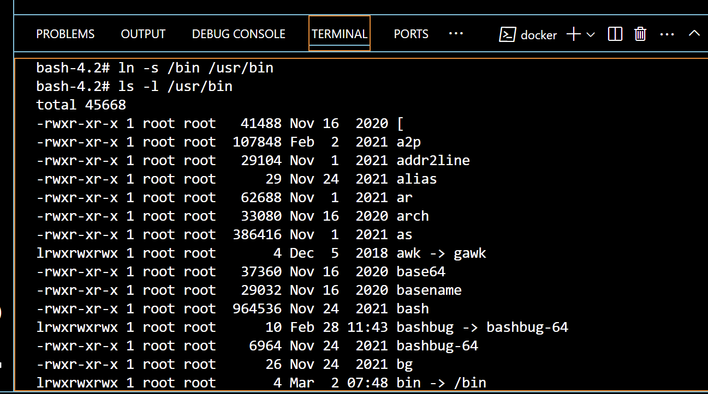

#### File attributes
**1. File Permissions**
   
   Di UNIX/Linux, setiap file memiliki 12 bit mode, yang terdiri dari 9 bit izin dan 3 bit tambahan yang mempengaruhi program yang dapat dieksekusi. Mode ini ditentukan saat file dibuat, dan dapat diubah oleh pemilik file atau superuser dengan menggunakan perintah chmod.
   **Permission Bits**
   - Tiga Grup Bit Izin:
     - u (owner/pemilik): Menentukan izin untuk pemilik file.
     - g (group/kelompok): Menentukan izin untuk anggota grup file.
     - o (others/orang lain): Menentukan izin untuk semua pengguna lainnya.
   
   - Izin untuk file:
     - r (read): Membaca file.
     - w (write): Menulis atau memodifikasi file.
     - x (execute): Menjalankan file sebagai program atau skrip. 2 tipe executable file adalah: binaries, yang dijalankan langsung oleh CPU, dan script, yang dinterpretasikan oleh program seperti shell / python. terdapat konvensi di mana script dimulai dengan shebang line yang memberi tahu kernel untuk menggunakan interpreter apa, seperti: #!/usr/bin/perl. jika nonbinary executable file tidak ada memberikan spesifikasi khusus, maka interpreter yang diasumsikan adalah **sh** script.
    
     Misalnya, dengan menggunakan notasi oktal:
     - 400 untuk read (r) pada pemilik file.
     - 200 untuk write (w) pada grup file.
     - 100 untuk execute (x) pada orang lain.

   - Izin untuk direktori:
    - r (read): Menampilkan daftar file dalam direktori.
    - x (execute): Memungkinkan untuk memasuki direktori atau mencari file di dalamnya.
    - w (write): Membuat, menghapus, atau mengganti nama file dalam direktori.

**2. Setuid, Setgid, dan Sticky Bits**
- **Setuid (4000):**
  - Ketika Setuid diaktifkan pada sebuah file, file itu akan dijalankan dengan hak akses pemilik file, bukan hak akses user yang menjalankannya.
  - Misalnya, ada program yang butuh hak akses lebih tinggi (seperti akses root), tapi user biasa yang menjalankannya. Dengan Setuid, program itu tetap akan berjalan dengan hak akses pemilik file (yang mungkin root), bukan hak akses user biasa.
- **Setgid (2000):**
  - Ketika Setgid diaktifkan pada sebuah file, maka file itu akan menggunakan grup tertentu, bukan grup pengguna yang membuka atau menjalankannya.
  - Jika diaktifkan pada direktori, setiap file yang baru dibuat di dalam direktori itu akan otomatis mengikuti grup yang sama dengan grup direktori, bukan grup pengguna yang membuat file itu.
- **Sticky Bit (1000):**
  - Ketika Sticky Bit diaktifkan pada sebuah direktori, hanya pemilik file yang bisa menghapus atau mengganti nama file mereka sendiri di dalam direktori itu.
  - Fitur ini sering digunakan di direktori seperti /tmp, tempat banyak orang bisa menyimpan file sementara, agar mereka tidak bisa sembarangan menghapus atau mengubah file orang lain.

**ls command**
Perintah ls digunakan untuk menampilkan daftar file dan direktori, serta memeriksa atributnya.

Opsi -l menampilkan format panjang yang mencakup:
- Mode file
- Jumlah hard link
- Pemilik file
- Grup file
- Ukuran file (dalam byte)
- Waktu modifikasi file
- Nama file

Setiap direktori memiliki setidaknya dua hard link: satu untuk direktori itu sendiri (.) dan satu lagi untuk direktori induknya (..).

Output ls untuk file perangkat (device file) akan berbeda. Contohnya:
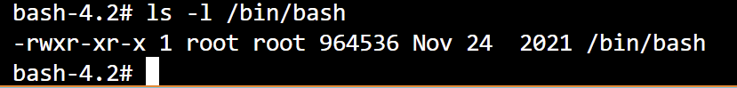

##### chmod: change permissions
Perintah chmod digunakan untuk mengubah mode (izin) file dengan dua cara:
- **Notasi Oktal:** Menggunakan angka (misalnya, chmod 755 file).
- **Notasi Mnemonik/simbolik:** Menggunakan simbol untuk menambahkan atau menghapus izin (misalnya, chmod u+w file untuk menambahkan izin tulis untuk pemilik file).


contoh penggunaan notasi mnemonik:
xamples of chmod's mnemonic syntax:

| Specifier  | Meaning                                                             |
| ---------- | ------------------------------------------------------------------- |
| u+w        | Add write permission for the file's owner                           |
| ug=rw,o=r  | Gives r/w permission to owner and group, and r permission to others |
| a-x        | Remove execute permission for all users                             |
| ug=srx, o= | Set the setuid, setgid, and sticky bits for owner and group (r/x)   |
| g=u        | Make the group's permissions the same as the owner's                |

tips: kita bisa menyalin mode (izin) dari file lain menggunakan opsi --reference. Contohnya, perintah chmod --reference=sourcefile targetfile akan memberikan mode yang sama dari sourcefile ke targetfile.

##### chown: change ownership
Digunakan untuk mengubah pemilik dan grup file. Syntax:
```bash
chown user:group file
# perintah -R dapat diterapkan untuk mengubah secara rekursif di seluruh isi direktori
```

##### chgrp: change group
Digunakan untuk mengubah grup file. Syntax:
```bash
chgrp group file
# -R juga memungkinkan perubahan dilakukan secara rekursif.
```

##### umask: set default permissions
Perintah umask menentukan izin default yang diterapkan pada file atau direktori yang baru dibuat. Nilai umask adalah sebuah bitmask yang mengurangi izin default (yang biasanya 777 untuk direktori dan 666 untuk file biasa) untuk menentukan izin akhir.

contoh:

```bash
$ umask 022
```

| Octal | Binary | Perms | Octal | Binary | Perms |
| ----- | ------ | ----- | ----- | ------ | ----- |
| 0     | 000    | rwx   | 4     | 100    | -wx   |
| 1     | 001    | rw-   | 5     | 101    | -w-   |
| 2     | 010    | r-x   | 6     | 110    | --x   |
| 3     | 011    | r--   | 7     | 111    | ---   |

contoh, **umask 027** memberikan izin rwx untuk pemilik, rx untuk grup, dan tidak ada izin untuk orang lain.

---

#### Access Control Lists
Access Control Lists (ACLs) adalah cara untuk memperluas model izin tradisional Unix. Dengan ACL, kita bisa memberikan beberapa pemilik pada sebuah file dan memberikan grup pengguna yang berbeda hak akses pada file yang berbeda, yang sulit dilakukan dengan sistem izin Unix standar. ACL memungkinkan penambahan entri kontrol akses untuk menentukan izin akses file dengan lebih spesifik.

##### Komponen ACL:
- **Access Control Entry (ACE):** Setiap aturan dalam ACL disebut sebagai ACE. Setiap ACE terdiri dari:
  - **User atau Group Specifier:** Menunjukkan siapa yang diberikan izin (misalnya, nama pengguna, nama grup, atau kata kunci khusus seperti "owner" atau "other").
  - **Permission Mask:** Merupakan serangkaian izin yang ditentukan (misalnya, read, write, execute).
  - **Type:** Menentukan apakah izin tersebut diberikan (allow) atau ditolak (deny).

##### Perintah untuk Mengelola ACL:
- **getfacl:** Digunakan untuk menampilkan ACL file. contoh:
  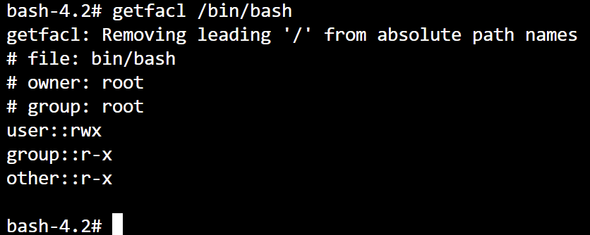

- **setfacl:** Digunakan untuk mengubah ACL file. syntax:
```bash
setfacl -m [tipe:identitas:hak_akses] [file/direktori]
# contoh penerapan: setfacl -m u:abdou:rw /etc/passwd
```
##### Jenis ACL:
- **POSIX ACLs:** Merupakan jenis ACL tradisional yang digunakan pada sistem Unix-like seperti Linux, FreeBSD, dan Solaris. Ini mendukung kontrol akses berdasarkan pemilik file, grup, dan pengguna lain.
  
  entries yang dapat digunakan:

 | Format                | Example         | Sets permissions for      |
 | --------------------- | --------------- | ------------------------- |
 | user::perms           | user:rw-        | The file's owner          |
 | user:username:perms   | user:abdou:rw-  | The user named username   |
 | group::perms          | group:r-x       | The file's group          |
 | group:groupname:perms | group:users:r-x | The group named groupname |
 | mask::perms           | mask::rwx       | The maximum permissions   |
 | other::perms          | other::r--      | Everyone else             |

- **NFSv4 ACLs:** Merupakan jenis ACL yang lebih baru dan lebih canggih, menawarkan fitur tambahan seperti ACL default yang digunakan untuk menetapkan ACL pada file dan direktori baru.