<div align="center">

# LAPORAN PRAKTIKUM


*tugas 3*  

**Workshop Administrasi Jaringan**  

  

**Nama Dosen Pengampu**:  
Bapak Dr. Ferry Astika Saputra ST, M.Sc  
<br>
**Dikerjakan oleh**:  
Nama: Moch. Alif Akbar  
Kelas: 2 D4 IT A  
NRP: 3123600025  

**DEPARTEMEN TEKNIK INFORMATIKA DAN KOMPUTER**  
**POLITEKNIK ELEKTRONIKA NEGERI SURABAYA**  
**2025**  
</div>

---

## SOAL
#### A. Instalasi NTP Client
   1. Install dan konfigurasi NTP client agar host anda mempunyai Waktu yang sinkron dengan NTP server di Indonesia. 
   2. nama NTP server yang harus dirujuk adalah ntp server Indonesia 
   Referensi : 
      1. https://www.server-world.info/en/note?os=Debian_12&p=ntp&f=1 
      2. https://www.ntppool.org/en/zone/id 
      3. Package terkait : ntp ntpssec 

#### B. Instalasi dan konfigurasi Samba
   1. Membuat public shared folder . Folder tersebut haru bisa diakses melalui Windows Client dan Linux Client via file manager 
   2. Membuat limited shared Folder. 
   3. akses ke folder Share dari CLI client 
   Referensi : https://www.server-world.info/en/note?os=Debian_12&p=samba&f=1 Package terkait : samba, smbclient, cifs-tools 

#### C. Buat rangkuman tentanag package management. Bahan ada di Materi ethol debian 12 sysadmin.

Di tiap nomor buat langkah-langkah instalasi, konfigurasi dan hasil (ouput) dari perintah-perintah terkait yang memastikan layanan dapat digunakan dengan baik

---

## JAWABAN
<br>

### A. Instalasi NTP Client

**1. instalasi NTP client:**<br><br>
   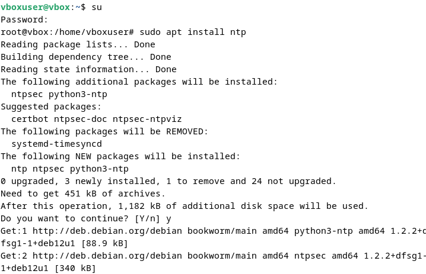
<br><br>

**2. Setting konfigurasi:**<br><br>
   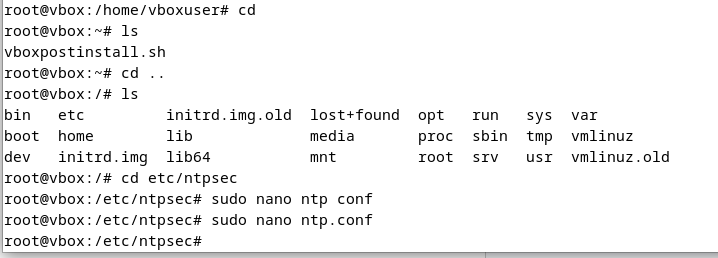
<br><br>

**3. Isi ntp.conf:**<br><br>
   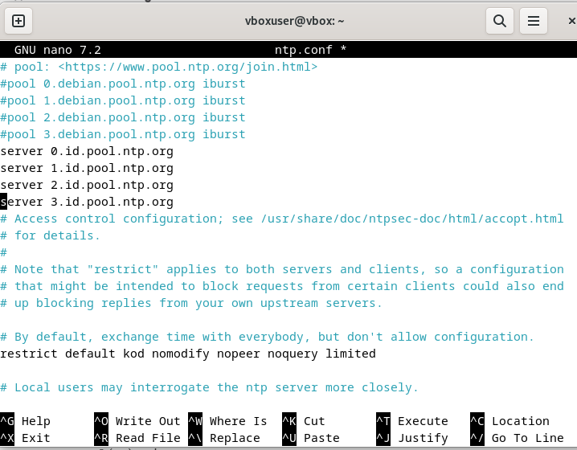
   <br><br>

   catatan: 
   - ntp server tersebut didapatkan dari: https://www.ntppool.org/en/zone/id
   
   kode yang digunakan adalah:
   ```bash
   server 0.id.pool.ntp.org
   server 1.id.pool.ntp.org
   server 2.id.pool.ntp.org
   server 3.id.pool.ntp.org
   ```
<br><br>

**4. Hasil:**<br><br>
   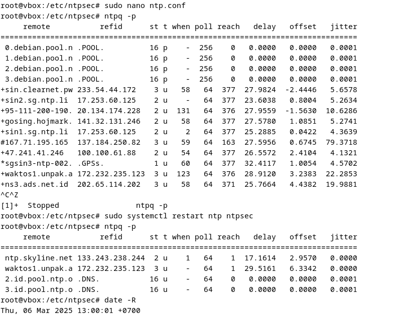
   <br><br>
   catatan:
   - ntpq -p digunakan untuk melihat daftar server ntp, pada awalnya menggunakan debian pool, namun setelah restart berhasil menggunakan server pada zone id. 
   - systemctl restart ntp ntpsec digunakan untuk restart pada ntp.
<br><br>

---

### B. Instalasi dan konfigurasi Samba

**1. instalasi Samba:**<br><br>
   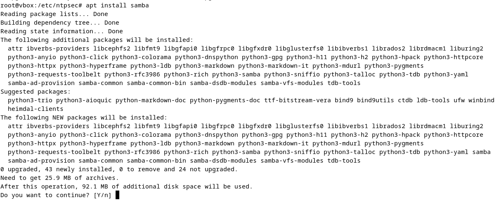
<br><br>

**2. pembuatan folder:**<br><br>
   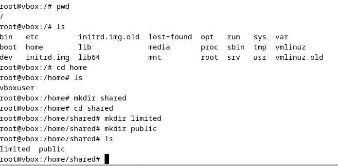<br><br>
   catatan:
   command **mkdir** digunakan untuk membuat direktori shared, di dalam direktori tersebut kemudian dibuatkan 2 direktori yakni public, dan limited yang nantinya akan digunakan untuk melihat hasil samba.
<br><br>

**3. Konfigurasi dengan perintah *sudo nano /etc/samba/smb.conf*:**<br><br>
   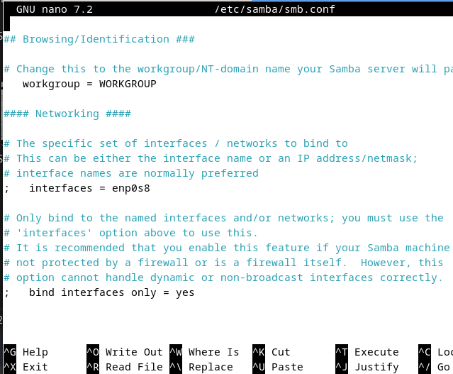<br><br>
   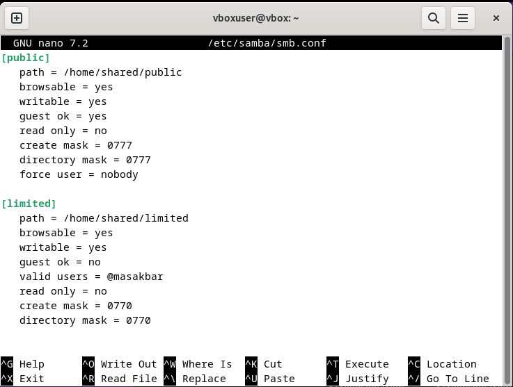<br><br>
   catatan:
   kode yang ditambahkan:
   ```bash
   interfaces = enp0s8

   [public]
      path = /home/shared/public
      browsable = yes
      writable = yes
      guest ok = yes
      read only = no
      create mask = 0777
      directory mask = 0777
      force user = nobody

   [limited]
      path = /home/shared/limited
      browsable = yes
      writable = yes
      guest ok = no
      valid users = @masakbar
      read only = no
      create mask = 0770
      directory mask = 0770
   ```
   penjelasan:
   - **interface:** berfungsi untuk mengarahkan sharing file ke interface yang diinginkan.
   - **path:** Direktori yang ingin dibagikan.
   - **browsable:** Direktori ini dapat terlihat dan dijelajahi oleh user lain di jaringan.
   - **writable:** Pengguna dapat menulis file di direktori ini.
   - **guest ok:** Akses tamu, artinya user harus terautentikasi untuk mengakses folder ini(jika no).
   - **valid users:** Hanya pengguna yang menjadi bagian dari grup / user tertentu yang dapat mengakses direktori ini. caranya adalah dengan langsung menambahkan nama user atau @namagrup untuk grup.
   - **read only:** Direktori hanya dapat dibaca.
   - **create mask:** Menentukan izin default yang diterapkan pada file baru yang dibuat di direktori yang dibagikan.
   - **directory mask:** Menentukan izin default yang diterapkan pada direktori baru yang dibuat di dalam direktori yang dibagikan.
   - **force user:** Memaksa Samba untuk menjalankan akses file dengan pengguna tertentu, meskipun pengguna yang sebenarnya berbeda.
<br><br>

**4. pengubahan aturan:**
   - pada direktori /shared/public:<br><br>
      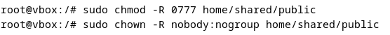<br><br>
   - pada direktori /shared/limited:<br><br>
      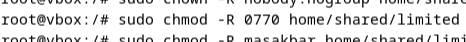<br><br>
      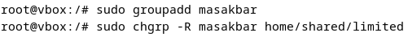<br><br>
   - pembuatan user baru yang akan dimasukkan ke group:<br><br>
      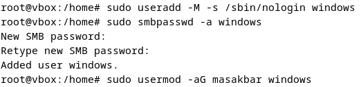<br><br>
   - restart snmb dan nmdb:<br><br>
      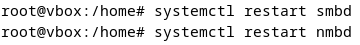<br><br>
   catatan:
   - *chmod -R* digunakan untuk mengubah izin secara rekursif.
   - *chown -R* mengganti kepemilikan user dan group.
   - *chgrp -R* ganti kepemilikan group.
   - *sudo useradd -M -s /sbin/nologin windows*   # Membuat user tanpa home directory (`-M`) dan tanpa shell login (`/sbin/nologin`).
   - *smbpasswd -a* menambahkan user ke samba dengan password.
   - *sudo usermod -aG* menambahkan user ke grup.

**5. hasil:**
   1. install smbclient(untuk linux host)<br><br>
      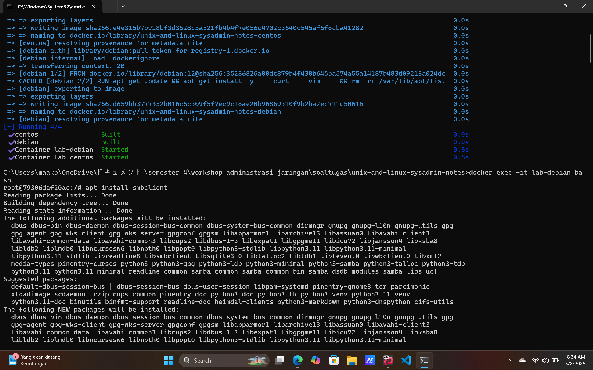<br><br>
   2. mencoba akses dan keamanan direktori(linux host):<br><br>
      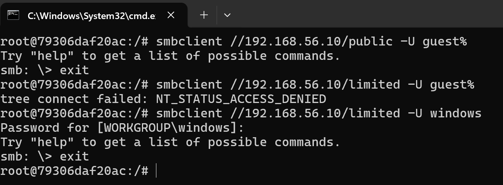<br><br>
      catatan:
      - code: 
         ```bash
         smbclient //192.168.56.10/public -U guest% # mencoba akses public dengan guest -> berhasil
         smbclient //192.168.56.10/limited -U guest% # mencoba akses limited dengan guest -> gagal
         smbclient //192.168.56.10/limited -U windows # mencoba akses limited dengan windows -> berhasil, windows masuk dalam group.
         ```
   3. gambaran direktori di windows:<br><br>
      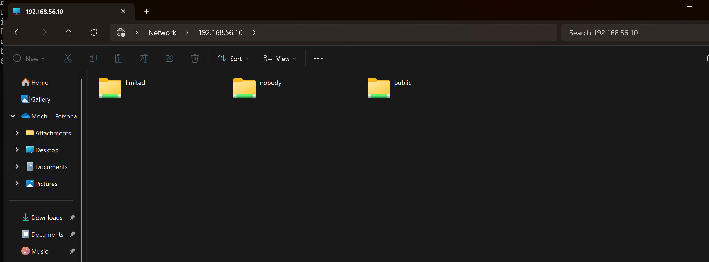<br><br>
      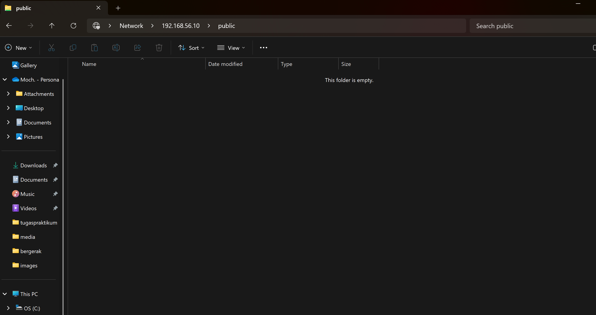<br><br>
      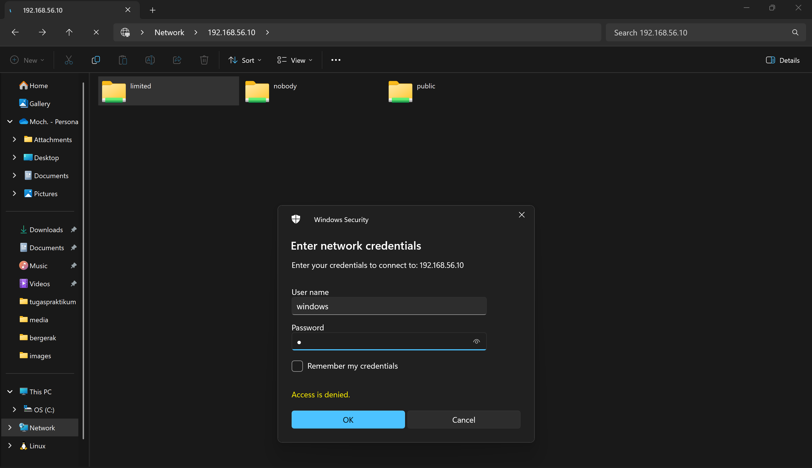<br><br>
      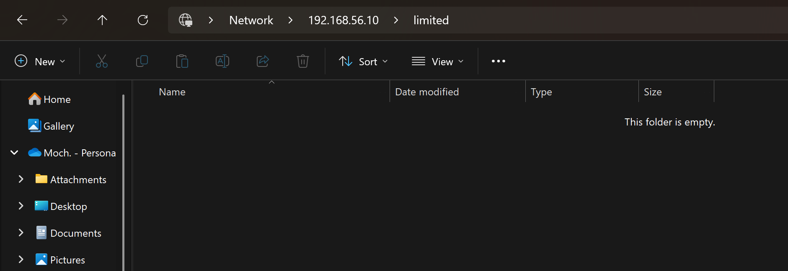<br><br>
      <br><br>
      cara ganti kredensial:<br><br>
      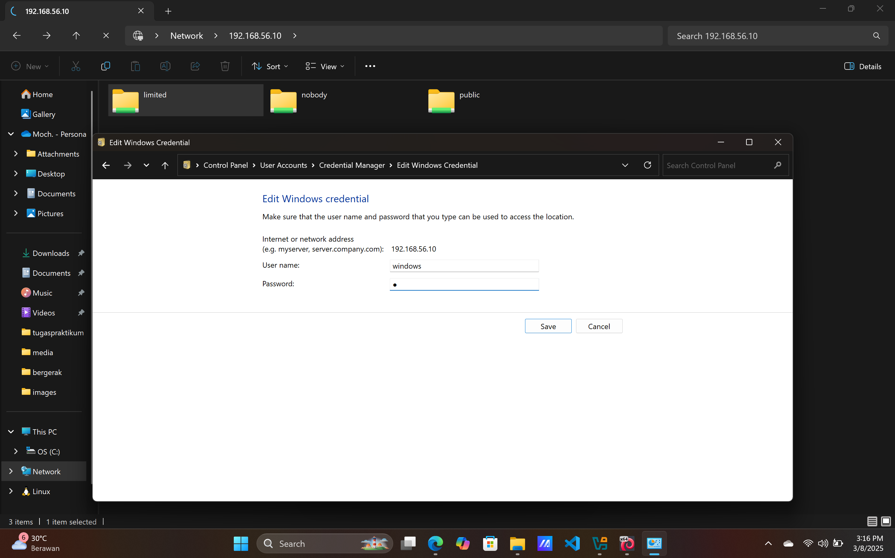<br><br>

   4. contoh implementasi kegunaan:
      - transfer file windows -> linux:
         1. membuat direktori baru di public yang akan menyimpan foto dari windows:<br><br>
            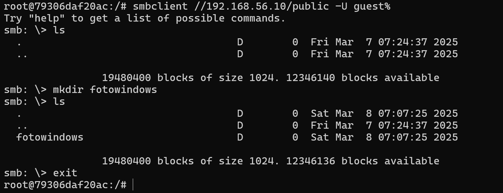<br><br>
            **hasil:**<br><br>
            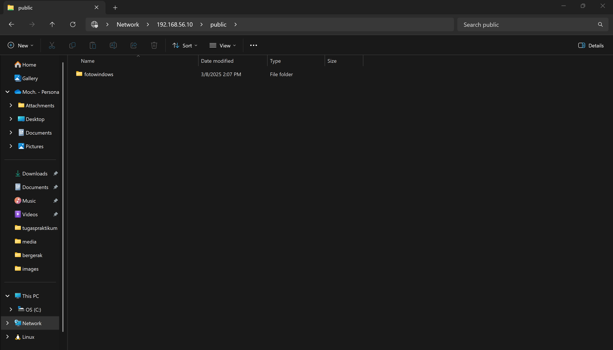<br><br>
         2. copy dan paste file yang diinginkan:<br><br>
            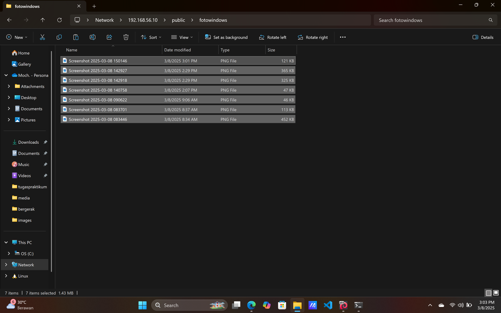<br><br>
         3. hasil:<br><br>
            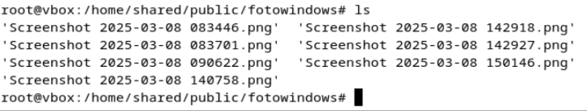<br><br>
      - transfer file linux -> windows:<br><br>
         1. copy screenshot dari linux ke direktori limited:<br><br>
            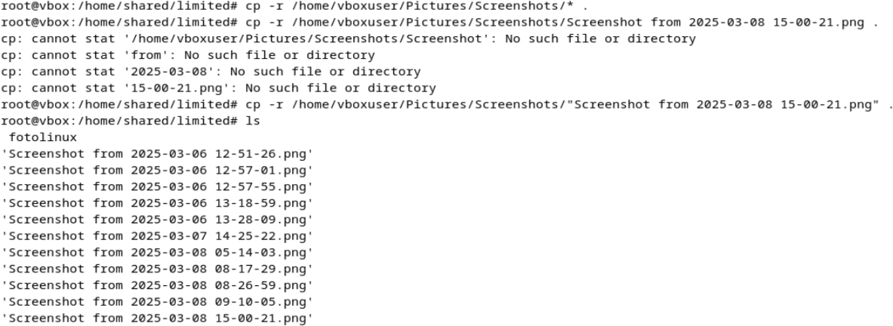<br><br>
         2. hasil:<br><br>
            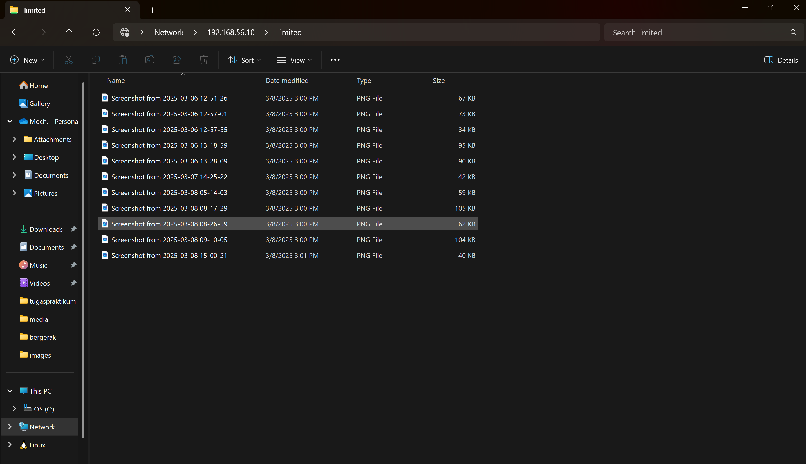<br><br>

---

### C. Package Management:
#### Repositori debian:
   - ***File sources.list:***
      Alamat repositori debian akan disimpan di */etc/apt/sources.list* atau file .list di */etc/apt/sources.list.d/*. ini digunakan untuk menentukan alamat repository yang menyediakan paket software.

      Edit sources.list:
      ```bash
      sudo apt edit-sources # atau
      nano sources.list
      ```
      <br><br>

      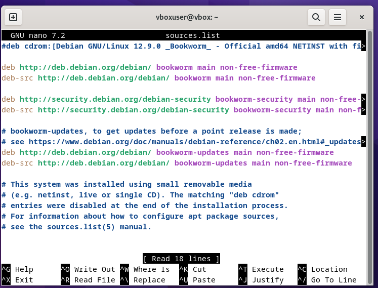<br><br>

      <br>komponen utama:
      | komponen         | Deskripsi                                                                 |
      | ---------------- | ------------------------------------------------------------------------- |
      | `deb`            | Repository biner (paket yang sudah dikompilasi dan siap untuk diinstall). |
      | `deb-src`        | Repository kode sumber (untuk kompilasi manual).                          |
      | `<URL>`          | Alamat server repositori                                                  |
      | `<distribution>` | Nama versi Debian atau cabang repositori                                  |
      | `<section>`      | Kategori paket (contoh: main, contrib, non-free, non-free-firmware).      |

      <br><br>
      **Kenapa menggunakan versi "bookworm", dan bukan "stable" di mana sistem berbasis pada debian stable?**

      bookworm adalah nama kode spesifik untuk Debian 12 (versi stabil saat ini). stable adalah istilah generik yang merujuk ke versi stabil terbaru.

      - Jika menggunakan stable, sistem akan otomatis beralih ke versi stabil baru (misal: Debian 13 "Trixie") saat dirilis.

      - Dengan menggunakan nama kode spesifik (e.g., bookworm), admin memiliki kendali penuh untuk memutuskan kapan ingin upgrade ke versi baru.

      Setelah rilis versi baru, bookworm akan berubah status menjadi oldstable.

#### repositories, branches & sections/components
   
   **Section:**
   
   | komponen            | Deskripsi                                                                                      |
   | ------------------- | ---------------------------------------------------------------------------------------------- |
   | `main`              | Berisi paket yang sepenuhnya free dan memenuhi Debian Free Software Guidelines (DFSG).         |
   | `contrib`           | Berisi paket yang free, tetapi bergantung pada paket non-free untuk kompilasi atau eksekusi.   |
   | `non-free`          | Berisi paket berpemilik (proprietary) yang tidak memenuhi DFSG.                                |
   | `non-free-firmware` | Subset dari non-free yang khusus berisi firmware berpemilik untuk dukungan hardware.           |

   Penjelasan tentang DFSG dan Section Debian:
   DFSG (Debian Free Software Guidelines) adalah pedoman filosofis Debian yang mendefinisikan prinsip "software free" (libre software).

   Paket harus memenuhi kriteria kebebasan:
   - Bebas digunakan, dimodifikasi, dan didistribusikan ulang.
   - Kode sumber harus tersedia secara terbuka.

   Mengingat hal tersebut, dan tergantung pada jenis hardware, sangat mungkin services tidak berfungsi dengan benar tanpa menggunakan driver (proprietary/hak milik) tertentu. Dalam kasus tersebut, kita perlu memodifikasi file `/etc/apt/sources.list`.

#### Backport Package
   **Apa Itu Backports?**
   Backports adalah repositori khusus yang menyediakan versi lebih baru dari beberapa aplikasi untuk versi stabil Debian (stable). Mekanisme ini memungkinkan pengguna sistem stabil mengakses aplikasi terbaru tanpa harus beralih ke versi testing atau unstable.

   - Tujuan: Memberikan pembaruan aplikasi tanpa mengorbankan stabilitas sistem.

   - Keamanan:
      - Backports tidak diaktifkan secara default dan tidak menggantikan repositori reguler.
      - Repositori reguler tetap memiliki prioritas tertinggi. Hanya aplikasi yang diinstal secara eksplisit dari backports yang akan menggunakan paket dari sana.
      - Tidak ada risiko sistem tidak stabil selama instalasi dilakukan sesuai panduan.

#### Cara Kerja Backports
**Proses Backporting:**
Developer Debian mengambil versi terbaru suatu aplikasi dari repositori development (misal: testing atau unstable).
Aplikasi tersebut dikompilasi ulang (re-build) agar kompatibel dengan dependensi yang ada di versi stabil (stable).

Contoh: LibreOffice versi terbaru di-backport ke Debian 12 (Bookworm) tanpa mengubah versi dasar sistem.

**Dependensi:**
Paket backports dirancang untuk bekerja dengan dependensi yang sudah ada di repositori stabil.
Tidak ada peningkatan paket sistem inti (misal: kernel, library dasar).

**Cara Menggunakan Backports**
Aktifkan Repositori Backports:
Tambahkan baris berikut ke `/etc/apt/sources.list`:
```bash
deb http://deb.debian.org/debian bookworm-backports main contrib non-free non-free-firmware  
```
<br>
<br>

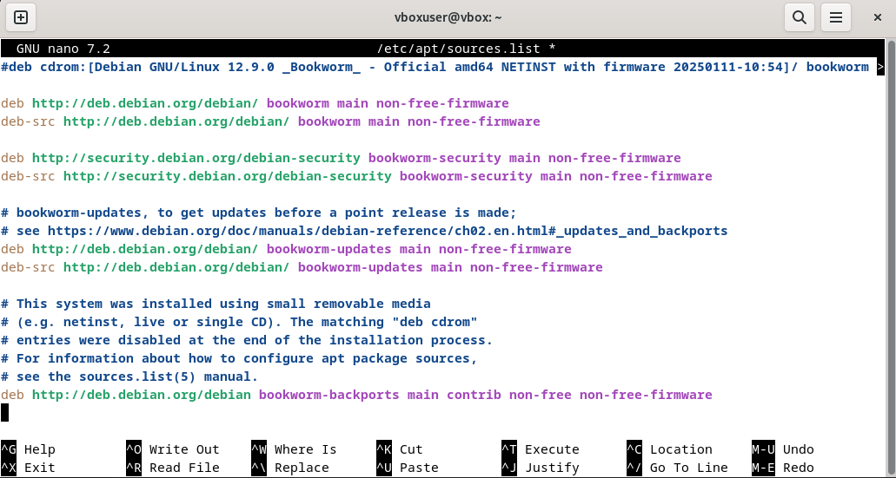<br><br>
Lalu update repositori:
```bash
sudo apt update 
``` 

Instal Paket dari Backports:
```bash
sudo apt install -t bookworm-backports <nama-paket>
```

jika ingin mencari package:
- Search Package Tool (untuk mencari paket spesifik): 
   https://backports.debian.org/Packages/ 

- Pencarian Berdasarkan Kategori:
   https://packages.debian.org/bookworm-backports/.

#### APT dalam Terminal

**APT (Advanced Package Tool)** adalah alat utama untuk mengelola paket Debian melalui terminal.

**Perintah untuk Pengguna Biasa**
Dapat dijalankan **tanpa hak admin**:

| Perintah                  | Deskripsi                                  |
|---------------------------|--------------------------------------------|
| `apt show <paket>`        | Menampilkan informasi detail paket         |
| `apt search <kata-kunci>` | Mencari paket berdasarkan nama/deskripsi   |
| `apt-cache policy <paket>`| Menampilkan versi paket yang tersedia      |

**Perintah Mode Administrator**
Harus dijalankan dengan **hak root**:

| Perintah                   | Deskripsi                                                                 |
|----------------------------|---------------------------------------------------------------------------|
| `apt update`               | Memperbarui metadata repositori                                          |
| `apt install <paket>`      | Menginstal paket + dependensinya                                         |
| `apt upgrade`              | Memperbarui paket terinstal (tanpa perubahan dependency)                 |
| `apt full-upgrade`         | Memperbarui paket sambil menangani perubahan dependency                  |
| `apt remove <paket>`       | Menghapus paket (menyimpan konfigurasi)                                  |
| `apt purge <paket>`        | Menghapus paket + konfigurasi                                            |
| `apt autoremove`           | Menghapus dependensi tidak terpakai                                      |
| `apt clean`                | Membersihkan cache paket terinstal                                       |
| `apt autoclean`            | Membersihkan cache paket usang                                           |
| `apt-mark showmanual`      | Menampilkan paket yang diinstal manual                                   |

**Contoh Perintah All-in-One**

**1. Update sistem + bersihkan cache**:
```bash
sudo apt update && sudo apt full-upgrade && sudo apt autoclean
```
<br>

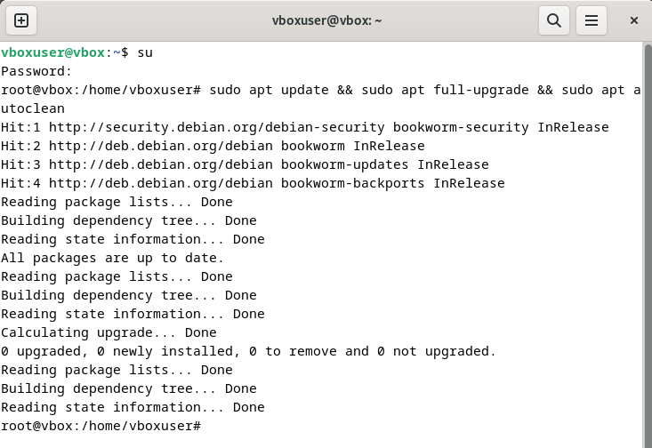<br>

**2. Hapus paket yang tidak berguna**
```bash
sudo apt autoremove --purge
```
<br>

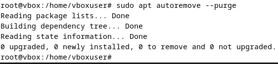<br>

#### Software (Gnome Software):
Gnome Software memungkinkan pencarian aplikasi melalui kategori atau langsung dengan nama aplikasi. Instalasi aplikasi dapat dilakukan dengan mengklik tombol "Install" dan memasukkan password administrator. Pembaruan sistem dapat dilakukan melalui bagian "Updates". Modifikasi repositori bisa dilakukan melalui menu "Repositories". Pembaruan otomatis dapat diaktifkan melalui menu "Update Preferences".

#### Discover (KDE Discover):
KDE Discover memungkinkan pencarian dan instalasi aplikasi melalui kategori atau langsung dengan nama aplikasi. Pembaruan sistem dapat dilakukan melalui bagian "Updates". Modifikasi repositori bisa dilakukan melalui menu "Settings". Discover juga memungkinkan instalasi widget dan addons untuk lingkungan desktop Plasma.

#### Synaptic
Synaptic adalah antarmuka grafis yang komprehensif dari manajer paket Debian. Ini memungkinkan pandangan menyeluruh tentang paket-paket yang tersedia, baik yang terinstal maupun yang tidak. Synaptic jauh lebih rinci dibandingkan dengan Software Center atau Discover (lihat bab sebelumnya) karena menampilkan seluruh set paket yang tersedia (termasuk pustaka/paket dependensi).

- Menyediakan fungsionalitas yang sama seperti apt. 
- kita perlu memasukkan kata sandi administrator untuk membuka dan menggunakan Synaptic. 
- Sambungan internet aktif juga diperlukan untuk menginstal atau memperbarui software kita.

<br>

**Synaptic: Main Interface**<br>
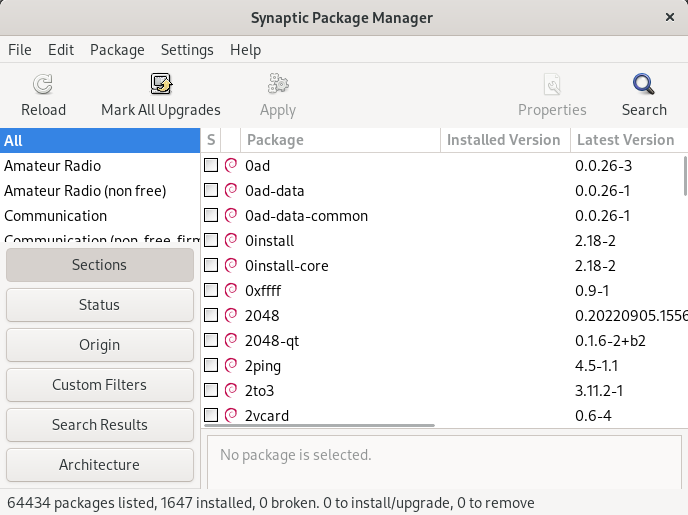<br>
Jendela Synaptic dibagi menjadi 4 area: 
- bilah alat di bagian atas, 
- panel kiri yang memungkinkan berbagai cara untuk menyortir dan memilih paket, 
- panel tengah yang menampilkan daftar paket itu sendiri, dan di bawahnya, 
- panel yang menampilkan deskripsi paket yang dipilih saat ini (pemilihan dilakukan dengan klik).  

Di depan setiap paket, kita akan melihat sebuah kotak kecil (putih untuk paket yang belum diinstal, hijau ketika sudah diinstal, merah ketika rusak). Di samping kotak status ini, logo Debian menunjukkan bahwa paket ini adalah "gratis" (dalam arti kebebasan).  
Jangan takut merusak sistem kita karena tidak ada yang akan terjadi sampai kita mengklik tombol “Apply”. Selain itu, pesan konfirmasi akan selalu ditampilkan terlebih dahulu.  

Hal pertama yang harus dilakukan saat meluncurkan Synaptic adalah mengklik tombol “Reload” untuk memperbarui semua informasi (metadata) mengenai repositori, paket, dan aplikasi yang tersedia.

#### Cleaning the system
Debian menyediakan beberapa alat untuk membersihkan sistem dan mengoptimalkan ruang disk, seperti:

**Ncdu**:
- Alat analisis ruang disk dalam mode terminal.
- Untuk menginstal:
  ```bash
  apt update && apt install ncdu
  ```
- Untuk menjalankan:
  ```bash
  ncdu
  ```

**Baobab**:
- Alat analisis ruang disk dalam mode grafis.
- Untuk menginstal:
  ```bash
  apt update && apt install baobab
  ```

**Membersihkan Cache Paket**:
- `apt clean`: Membersihkan cache paket yang terinstal.
- `apt autoclean`: Membersihkan cache paket yang sudah usang.
- `apt autoremove --purge`: Menghapus paket yang tidak diperlukan beserta file konfigurasinya.

**Membersihkan Sampah (Trash)**:
- Sampah pengguna: `rm -Rf ~/.local/share/Trash/*`
- Sampah administrator: `rm -Rf /root/.local/share/Trash/*`
- Sampah di disk eksternal: Biasanya terletak di `/media/your_id/your_disk/.Trash_1000`.

**Membersihkan Cache Aplikasi**:
- `rm -Rf ~/.cache/*`: Membersihkan cache aplikasi yang disimpan di direktori `.cache`.

**Membersihkan Thumbnail**:
- `rm -Rf ~/.thumbnails`: Membersihkan thumbnail yang sudah tidak digunakan.

File konfigurasi yang tersisa setelah penghapusan paket dapat dibersihkan dengan perintah berikut:
- Menampilkan file konfigurasi yang tersisa:
  ```bash
  dpkg --list | awk '/^rc/ {print $2}'
  ```
- Menghapus file konfigurasi yang tersisa:
  ```bash
  apt purge $(dpkg --list | awk '/^rc/ {print $2}')
  ```

untuk yang lebih keras, kita juga dapat menginstall Deborphan yang dapat mendeteksi dan menghapus paket yang tidak terpakai (orphaned packages).

**Deborphan**:
- Untuk menginstal:
  ```bash
  apt install deborphan
  ```
- Untuk menampilkan daftar paket yang tidak terpakai:
  ```bash
  echo $(deborphan)
  ```
- Untuk menghapus paket yang tidak terpakai:
  ```bash
  apt autoremove --purge $(deborphan)
  ```

#### Installing external “.deb” packages
Debian mendukung instalasi paket eksternal dalam format `.deb`.

**GDebi**:
Merupakan alat grafis untuk menginstal paket `.deb` sambil mengelola dependensi.
- Untuk menginstal GDebi:
  ```bash
  apt update && apt install gdebi
  ```
- Setelah mengunduh paket `.deb`, klik kanan dan pilih "Open with gdebi" untuk menginstalnya.

**Dpkg**:
Adalah terminal untuk menginstal paket `.deb` tanpa mengelola dependensi.
- Perintah dasar:
  - Instalasi: `dpkg -i package_name.deb`
  - Jika ada dependensi yang hilang, instal secara manual dengan `apt install dependency_1 dependency_2 ...`
  - Penghapusan: `dpkg --purge package_name`


#### Installing Flatpak applications
Flatpak adalah sistem virtualisasi aplikasi yang memungkinkan instalasi aplikasi dalam lingkungan terisolasi (sandbox).

**Instalasi Flatpak**:
- Instalasi paket Flatpak:
  ```bash
  apt install flatpak
  ```
- Menambahkan repositori Flatpak (contoh: Flathub):
  ```bash
  flatpak remote-add flathub https://flathub.org/repo/flathub.flatpakrepo
  ```

**Manajemen Flatpak**:
- **Gnome**: Menggunakan plugin `gnome-software-plugin-flatpak`.
- **KDE**: Menggunakan plugin `plasma-discover-backend-flatpak`.
- **Terminal**: Perintah seperti `flatpak install`, `flatpak uninstall`, dan `flatpak update`.

**Contoh Instalasi Flatpak**:
- Instalasi LibreOffice dari Flathub:
  ```bash
  flatpak install flathub org.libreoffice.LibreOffice
  ```
- Menjalankan aplikasi Flatpak:
  ```bash
  flatpak run org.libreoffice.LibreOffice
  ```

#### Distribusi Debian
Debian memiliki beberapa cabang distribusi yang berjalan secara paralel:

- **Stable**: Versi resmi Debian yang direkomendasikan untuk penggunaan sehari-hari.
- **Oldstable**: Versi stabil sebelumnya, biasanya didukung selama satu tahun setelah rilis versi stabil baru.
- **Testing**: Versi yang sedang dipersiapkan untuk menjadi versi stabil berikutnya.
- **Unstable (Sid)**: Versi yang menerima pembaruan terbaru, tetapi kurang stabil.
- **Experimental**: Repositori untuk menguji versi alpha atau beta perangkat lunak.