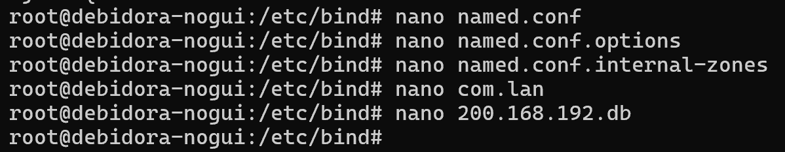
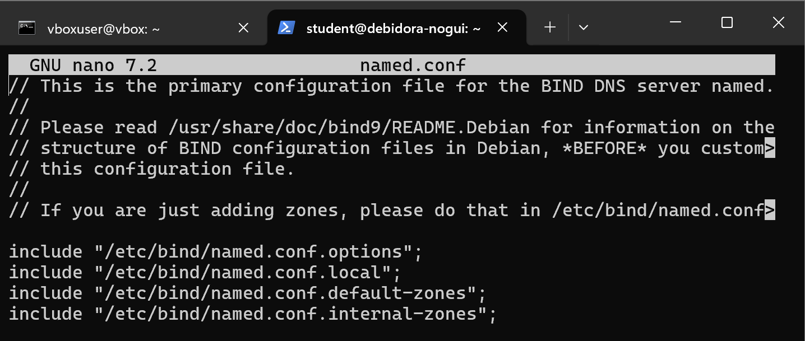
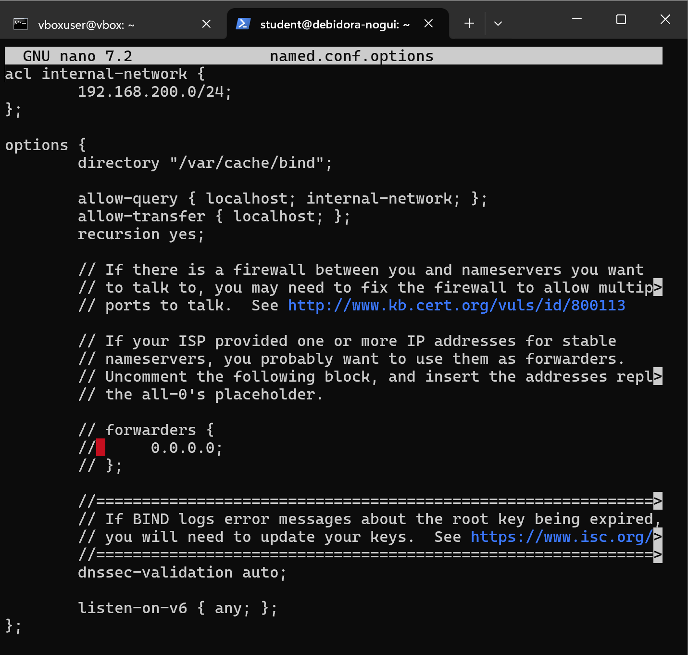
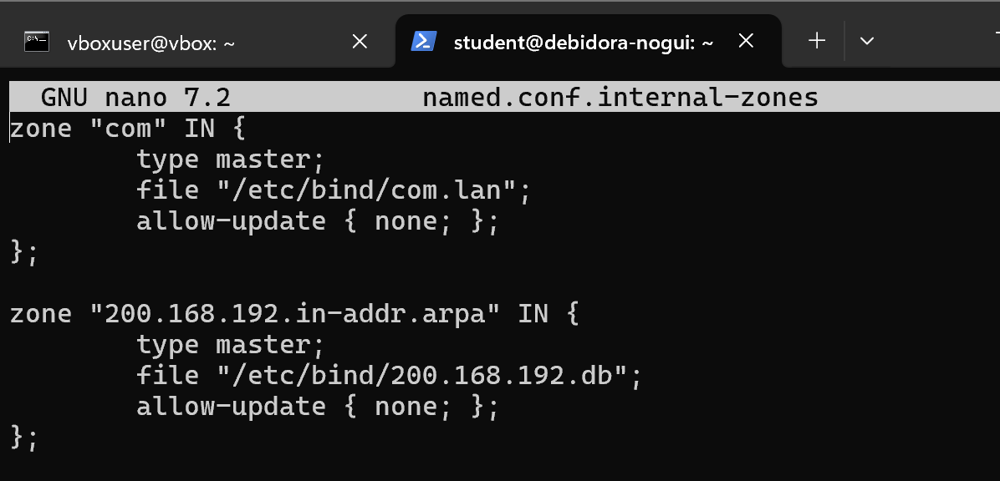
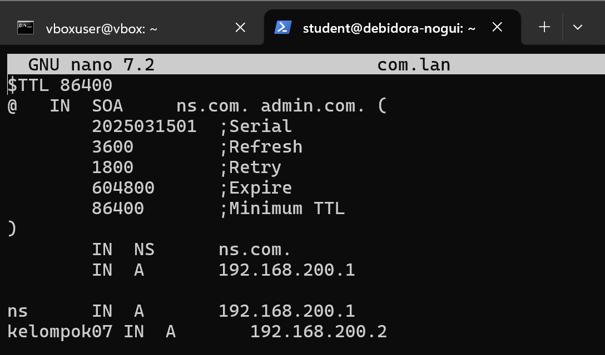
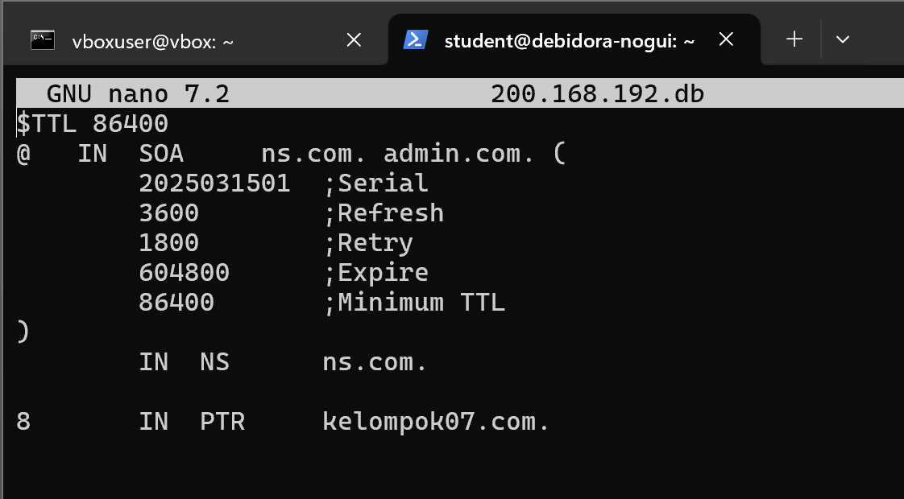
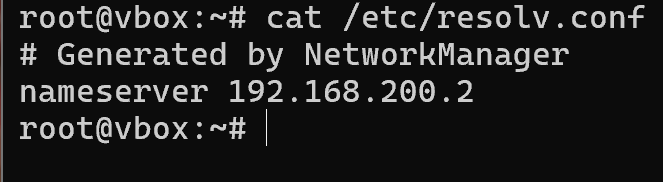
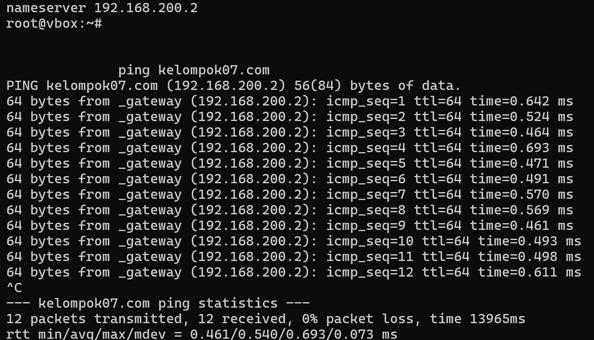
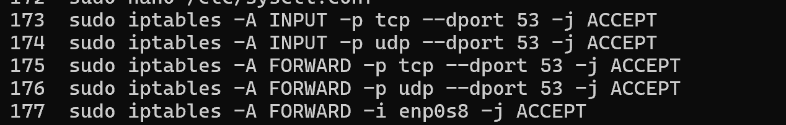

# LAPORAN PRAKTIKUM

*dns*  

**Workshop Administrasi Jaringan**  

  

**Nama Dosen Pengampu**:  
Bapak Dr. Ferry Astika Saputra ST, M.Sc  
 
**Dikerjakan oleh**:  
Nama: Moch. Alif Akbar  
Kelas: 2 D4 IT A  
NRP: 3123600025  

**DEPARTEMEN TEKNIK INFORMATIKA DAN KOMPUTER**  
**POLITEKNIK ELEKTRONIKA NEGERI SURABAYA**  
**2025**  

---

## Rangkuman
DNS atau Domain Name System adalah sistem yang digunakan untuk menerjemahkan nama domain menjadi alamat IP (Internet Protocol) yang digunakan oleh komputer untuk saling berkomunikasi di internet.

#### fitur dns:
- **Multiple DNS servers managed by different operators**  
  DNS menggunakan server yang tersebar secara global dan dikelola oleh berbagai operator untuk mengurangi latency dan meningkatkan redundansi.

- **Loosely coherent**  
  Meskipun server DNS terdistribusi, mereka tetap terintegrasi dalam satu sistem global, memastikan konsistensi data secara bertahap (*eventual consistency*).

- **Scalable**  
  Sistem DNS dirancang untuk menangani pertumbuhan dengan mudah melalui penambahan server atau infrastruktur, baik secara vertikal maupun horizontal.

- **Reliable**  
  DNS merupakan komponen kritis internet, sehingga dirancang dengan mekanisme failover, redundansi, dan proteksi DDoS untuk memastikan ketersediaan tinggi (*high availability*).

- **Dynamic**  
  DNS mendukung update record secara real-time (misalnya melalui DDNS) tanpa menyebabkan downtime, memungkinkan penambahan domain atau perubahan konfigurasi secara fleksibel.

#### Protokol dan Port
- **UDP port 53**  
  Mayoritas permintaan dan respons DNS menggunakan protokol **UDP** karena overhead rendah dan cocok untuk pertukaran data kecil yang membutuhkan kecepatan.

- **TCP port 53**  
  Digunakan dalam kasus khusus:  
  - Transfer data besar (misalnya: *zone transfers* antar server DNS untuk sinkronisasi data zona).  
  - Jika respons DNS melebihi ukuran maksimum paket UDP (512 byte), protokol TCP akan digunakan.  

#### Tahapan Resolusi DNS
1. **Request dari User**  
   - User mengetik domain (contoh: `www.example.com.au`) di browser.  
   - Browser pertama kali memeriksa **cache lokal** (riwayat penyimpanan sementara) untuk mencari alamat IP yang sudah pernah diakses.
 
2. **Hubungi DNS Resolver**  
   - Jika tidak ada di cache, browser menghubungi **DNS Resolver** (biasanya milik ISP atau layanan seperti Google DNS).  
   - Resolver ini bertugas mencari alamat IP dari domain yang diminta.
 
3. **Pencarian Hierarkis**  
   - Resolver mulai bertanya ke **Root Server** untuk mengetahui server mana yang mengelola ekstensi domain (misal: `.com`).  
   - Root Server mengarahkan ke **TLD Server** (Top-Level Domain Server) yang mengelola ekstensi tersebut. 
    
   - Berikut macam macam TLD:
        - **Country-code TLDs (ccTLDs)** 
        **Definisi**: Kode domain dua huruf yang mewakili negara atau wilayah tertentu.  
        **Contoh**: `.id` (Indonesia), `.us` (Amerika Serikat), `.jp` (Jepang).   
        **Fungsi**: Digunakan untuk situs yang terkait dengan wilayah geografis tertentu.  
 
        - **Generic TLDs (gTLDs)**  
        **Definisi**: Domain tingkat atas umum yang tidak terikat pada lokasi geografis dan dikategorikan berdasarkan tujuan atau industri.  
        **Contoh**: `.com` (komersial), `.org` (organisasi), `.gov` (pemerintah AS), `.app` (aplikasi).  
        **Fungsi**: Mengelompokkan situs berdasarkan jenis entitas, layanan, atau tema tertentu.  
 
        - **Infrastructure TLD**  
        **Definisi**: TLD khusus yang digunakan untuk keperluan teknis infrastruktur internet.  
        **Contoh**: `.arpa` (digunakan untuk manajemen alamat dan routing jaringan).  
        **Fungsi**: Mendukung operasional teknis jaringan, seperti reverse DNS lookup.  
 
        - **Internationalized TLDs (IDN)**  
        **Definisi**: TLD yang menggunakan karakter non-ASCII (misal: aksara lokal atau simbol khusus).  
        **Contoh**: `.中国` (Tiongkok), `.рф` (Rusia), `.مصر` (Mesir).  
        **Fungsi**: Memungkinkan penggunaan nama domain dalam bahasa/aksara lokal untuk meningkatkan aksesibilitas pengguna global.  
  

4. **Mencari Authoritative Server**  
   - TLD Server memberi tahu **Authoritative Server** (server yang menyimpan data lengkap domain `example.com.au`).  
   - Authoritative Server merespons dengan alamat IP tujuan (misal: `m.n.o.p`).
 
5. **Hasil Dikirim ke Pengguna**  
   - Resolver menerima alamat IP dan menyimpannya di cache untuk mempercepat akses berikutnya.  
   - Browser akhirnya mengakses alamat IP tersebut (`m.n.o.p`) untuk menampilkan situs web.
 

#### Penjelasan Komponen DNS

##### 1. **Namespace**  
- **Definisi**:  
  Namespace DNS adalah struktur hierarkis global yang mengatur penamaan domain. Mirip seperti "pohon terbalik" dengan:  
  - **Root** (.) di puncak.  
  - **Top-Level Domains (TLD)** (contoh: `.com`, `.id`).  
  - **Second-Level Domains** (contoh: `example.com`).  
  - **Subdomains** (contoh: `blog.example.com`).  

- **Domains dan Zones**:  
  - **Domain**: Nama unik yang diidentifikasi dalam hierarki (misal: `example.com`).  
  - **Zone**: Bagian dari namespace yang dikelola oleh otoritas tertentu (misal: zona `example.com` mencakup semua subdomain dan record di bawahnya).  

##### 2. **Nameserver**  
- **Definisi**:  
  Server yang menyimpan dan mengelola data DNS untuk zona tertentu.  
- **Fungsi**:  
  - Menyimpan catatan DNS (A, MX, CNAME, dll.) dari zona yang diotorisasi.  
  - Merespons permintaan DNS resolver terkait record dalam zona tersebut.  
- **Jenis**:  
  - **Authoritative Nameserver**: Memiliki data resmi untuk zona tertentu.  
  - **Recursive Nameserver**: Mencari data dari nameserver lain jika tidak memiliki jawaban.  

##### 3. **Resolvers atau Clients**  
- **Definisi**:  
  Perangkat atau layanan yang mengirim permintaan (*query*) ke nameserver untuk menerjemahkan nama domain ke alamat IP.  
- **Contoh**:  
  - **Resolver**: Layanan seperti Google DNS (8.8.8.8) atau Cloudflare (1.1.1.1).  
  - **Client**: Browser, aplikasi, atau sistem operasi yang memulai permintaan DNS.  
- **Proses Kerja**:  
  1. Klien meminta resolver untuk menerjemahkan domain.  
  2. Resolver mencari jawaban dengan bertanya ke nameserver (root → TLD → authoritative).  
  3. Hasil dikirim kembali ke klien.  

---

## Konfigurasi Bind9

**1. install bind9** 
  

**2. setting konfigurasi (untuk domain windows.ku) pada file-file berikut** 
  

- pada **`/etc/bind/named.conf`**: 
      
    fungsi: File named.conf.internal-zones ditambahkan khusus untuk jaringan internal.
 
- pada **`/etc/bind/named.conf.options`**: 
      
    Fungsi: Mendefinisikan pengaturan global untuk server DNS.
    **acl internal-network:** Mendefinisikan jaringan 192.168.1.0/24 sebagai "jaringan internal"
    **directory:** Menentukan lokasi cache DNS
    **allow-query:** Mengizinkan komputer dari localhost dan jaringan internal untuk mengirim kueri DNS
    **allow-transfer:** Hanya mengizinkan transfer zona dari localhost (keamanan)
    **recursion yes:** Mengizinkan server mencari jawaban di server DNS lain jika tidak memiliki jawabannya
 
- pada **`/etc/bind/named.conf.internal-zones`**: 
      
    fungsi: Mendefinisikan zona DNS untuk domain "ku" dan zona reverse DNS.
    zone "ku": Mendefinisikan zona forward yang akan menerjemahkan nama domain "ku" dan subdomain-nya menjadi alamat IP
    **type master:** Server ini adalah sumber primer untuk zona ini
    **file:** Lokasi file yang berisi detail zona
    **allow-update:** Tidak mengizinkan pembaruan dinamis (keamanan)
    **zone "1.168.192.in-addr.arpa":** Zona reverse yang menerjemahkan alamat IP menjadi nama domain
 
- pada **`/etc/bind/ku.lan`**: 
      
    fungsi: Mendefinisikan detail zona "ku", termasuk catatan DNS.
    **$TTL:** Time To Live - berapa lama record boleh di-cache (86400 detik = 1 hari)
   **SOA:** Start of Authority - informasi otoritatif tentang zona:
    **- ns.ku.:** Server nama utama untuk zona
    **- admin.ku.:** Email admin (@ diganti dengan .)
    **- Serial:** Nomor versi konfigurasi (biasanya format tanggal YYYYMMDDNN)
   **- Refresh:** Berapa sering server sekunder harus memeriksa pembaruan (3600 detik)
    **- Retry:** Berapa lama menunggu jika pembaruan gagal (1800 detik)
   **- Expire:** Berapa lama data dianggap valid jika server utama tidak tersedia (604800 detik)
    **- Minimum TTL:** Default TTL minimum (86400 detik)

    **NS:** Name Server record - mendefinisikan ns.ku sebagai server nama untuk zona
    **A:** Address record - memberikan alamat IP untuk nama domain:
   **@ IN A:** IP untuk domain dasar (ku)
    **ns IN A:** IP untuk ns.ku
    **windows IN A:** IP untuk windows.ku (192.168.1.8)
 
- pada **`/etc/bind/1.168.192.db`**: 
      
    fungsi: Menerjemahkan alamat IP menjadi nama domain (reverse lookup).
    **8 IN PTR windows.ku.:** Mengarahkan IP 192.168.1.8 ke nama domain windows.ku

**3. setting resolver agar menggunakan dns lokal** 
      
    setting ini dilakukan karena domain windows.ku hanya dikenali oleh server dns lokal.

**4. hasil** 
      
      