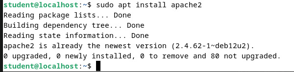

<div align="center">

# LAPORAN PRAKTIKUM


*dns*  

**Workshop Administrasi Jaringan**  

  

**Nama Dosen Pengampu**:  
Bapak Dr. Ferry Astika Saputra ST, M.Sc  
<br>
**Dibuat oleh:**  
Muhammad Fajar Siddiq 3123600004  
Moch. Alif Akbar 3123600025  
Renaldy Izza Briliandin Tino 3213600026  

**kelas:**
2 D4 Teknik Informatika A  

**DEPARTEMEN TEKNIK INFORMATIKA DAN KOMPUTER**  
**POLITEKNIK ELEKTRONIKA NEGERI SURABAYA**  
**2025**  
</div>

---

## Tujuan Praktikum
- Membuat jaringan lokal kelompok yang terdiri dari 3 komputer.
- Mengkonfigurasi komputer pak ferry sebagai router (gateway NAT) menggunakan iptables.
- Mengkonfigurasi komputer Akbar sebagai DNS Server menggunakan BIND9.
- Menguji koneksi dan fungsionalitas DNS dari komputer lain yang masih 1 lokal jaringan.

---

## Topologi

```
[Internet]
    |
  [K. P. Ferry] (Router)
  - enp0s3 (Bridge)
  - enp0s8 (Internal: 10.252.108.57)
    |
  [Internal Network]
    |-------------------|
  [Akbar] (192.168.7.10)   [Tes komputer(izza, fajar)] (192.168.7.x)
  - DNS Server            - Client Test
```


Pada praktikum ini, kami menggunakan tolopogi jaringan seperti berikut, dimana terdapat beberapa router kelompok yang terhubung ke 1 router master, pada gambar di atas, diibaratkan terdapat 3 router saja, dengan IP Address masing-masing `10.252.108.51`, `10.252.108.52`, dan `10.252.108.57`. Pada masing-masing router, terdapat satu client yang bertugas sebagai DNS server dan Web server dengan IP Address `192.168.x.10`.
Namun, karena pada praktikum kali ini, DNS dan Router sudah dikonfigurasi oleh pengguna lab jaringan sebelumnya, kami mengkonfigurasi untuk web server.

## Instalasi dan Konfigurasi Apache2

Pada tahap ini, kami akan menginstal dan mengkonfigurasi Apache2 sebagai web server pada komputer dengan IP 192.168.7.10 (DNS Server).

### Langkah 1: Instalasi Apache2

```bash
sudo apt install apache
```



### Langkah 2: Konfigurasi Apache2

Setelah menginstal Apache2, kami melakukan konfigurasi pada file konfigurasi utama Apache2.

```bash
sudo nano /etc/apache2/apache2.conf
```


Pada file konfigurasi tersebut, kami memastikan bahwa server dikonfigurasi dengan benar untuk melayani permintaan web dari jaringan internal.

## Konfigurasi DNS Server dengan BIND9

### Langkah 1: Instalasi BIND9

```bash
sudo apt install bind9 bind9utils bind9-doc -y
```


### Langkah 2: Konfigurasi Named

Kami mengkonfigurasi file named.conf untuk mengatur DNS server kami.

```bash
sudo nano /etc/bind/named.conf
```


Kami juga mengkonfigurasi opsi tambahan pada `named.conf.options` untuk mengoptimalkan DNS server:


### Langkah 3: Konfigurasi Zone Files

Kami membuat dan mengkonfigurasi zone files untuk domain yang akan dikelola oleh DNS server kami:

```bash
sudo nano /etc/bind/named.conf.local
```


### Langkah 4: Membuat Forward Zone File

Kami membuat forward zone file untuk domain yang akan di-hosting:

```bash
sudo nano /etc/bind/kelompok7.home
```


### Langkah 5: Pengujian Konektivitas dan Fungisionalitas

Kami menguji fungsionalitas DNS server dengan perintah `dig` dan `nslookup`:

```bash
dig kelompok7.home
nslookup kelompok7.home
```


## Konfigurasi Akses Domain dan Folder HTML

### Langkah 1: Pembuatan Struktur Folder HTML

Kami membuat struktur folder untuk menyimpan file-file website:


### Langkah 2: Pembuatan File HTML Sederhana

Kami membuat file HTML sederhana untuk menguji keberhasilan konfigurasi:

```bash
sudo nano /var/www/html/index.html
```


### Langkah 3: Hasil


## contoh hasil kelompok lain


## Kesimpulan

Dalam praktikum ini, kami berhasil mengkonfigurasi jaringan yang terdiri dari 3 komputer dengan fungsi yang berbeda:
1. Komputer dengan IP 10.252.108.10 sebagai router yang menghubungkan jaringan internal ke internet menggunakan NAT
2. Komputer dengan IP 192.168.7.10 sebagai DNS server dan web server yang menghosting domain
3. Komputer lain sebagai tester untuk memverifikasi fungsionalitas dari konfigurasi yang telah dilakukan

Melalui praktikum ini, kami mempelajari:
- Konfigurasi jaringan internal menggunakan VirtualBox
- Konfigurasi router menggunakan iptables untuk NAT
- Instalasi dan konfigurasi DNS server menggunakan BIND9
- Instalasi dan konfigurasi web server menggunakan Apache2
- Pengujian konektivitas dan fungsionalitas menggunakan berbagai tools

Praktikum ini memberikan pengalaman praktis dalam administrasi jaringan dan membantu kami memahami bagaimana komponen-komponen jaringan bekerja sama untuk menyediakan layanan kepada pengguna.