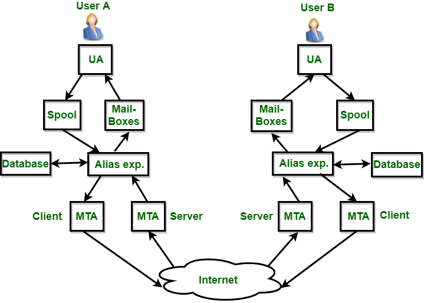

<div align="center">

# LAPORAN PRAKTIKUM


*email*  

**Workshop Administrasi Jaringan**  

  

**Nama Dosen Pengampu**:  
Bapak Dr. Ferry Astika Saputra ST, M.Sc  
<br>
**Dikerjakan oleh**:  
Nama: Moch. Alif Akbar  
Kelas: 2 D4 IT A  
NRP: 3123600025  

**DEPARTEMEN TEKNIK INFORMATIKA DAN KOMPUTER**  
**POLITEKNIK ELEKTRONIKA NEGERI SURABAYA**  
**2025**  
</div>

---

# Rangkuman Materi Email

## 1. Protokol dalam Email

### IMAP (Internet Message Access Protocol)

- ini merupakan protokol yang digunakan untuk **mengakses** email yang tersimpan di server. seperti yang dianalogikan yakni berupa kotak pos, di mana terdapat banyak pos-pos dari banyak user.
- Mendukung sinkronisasi antar perangkat, serta cocok untuk penggunaan multi-perangkat dan online.
- Port default IMAP: 143 (non-enkripsi), 993 (SSL).

### SMTP (Simple Mail Transfer Protocol)

- ini merupakan protokol yang digunakan untuk **mengirim** email dari klien ke server atau antar server.
- Port defaultnya: 25 (tanpa enkripsi), 587 (TLS), 465 (SSL).

### POP3 (Post Office Protocol v3)

- ini merupakan protokol yang digunakan untuk **mengambil** email dari server ke klien.
- Tujuan utama POP3 adalah mengunduh email dari server ke klien untuk disimpan lokal.
- Port default: 110 (non-enkripsi), 995 (SSL → POP3S).

### POP3S

- Versi aman dari POP3 yang menggunakan SSL & tidak langsung menghapus email yang ada di server.
- Port default: 995.

---

## 2. Informasi Mail Server dalam Sebuah Domain

<br><br><br><br>

- Mail server ditentukan oleh **MX Record (Mail Exchange Record)** dalam DNS.
- MX record menunjukkan server mana yang bertugas menerima email untuk domain tertentu.
- MX record memiliki **prioritas** untuk failover (cadangan server jika utama gagal).
- Contoh:
  ```bash
  nslookup -q=MX pens.ac.id 8.8.8.8
  ```

---

## 3. Penjelasan tentang cara kerja email

<br><br><br><br>

### Alur Pengiriman Email

1. User A akan menulis email via UA(seperti gmail).
2. Pesan yang dibuat akan disimpan sementara di Spool, dan diarsipkan di Mailboxes.
3. alamat email diperiksa atau diubah oleh Alias Expander berdasarkan data dari Database. kemudian Email akan dikirim ke MTA menggunakan **SMTP**.
4. MTA mencari server penerima via **MX Record**.
5. MTA mengirim email ke MTA penerima melalui internet.
6. setelah diterima MTA oenerima, pesan diproses oleh Alias Expander(dicari ke mana tujuan yang benar). lalu disimoan ke MailBox dan Spool.
7. email diakses oleh penerima melalui UA
---